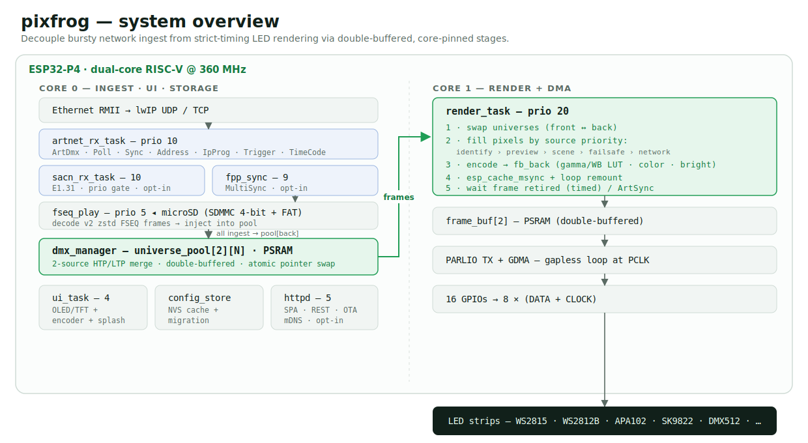
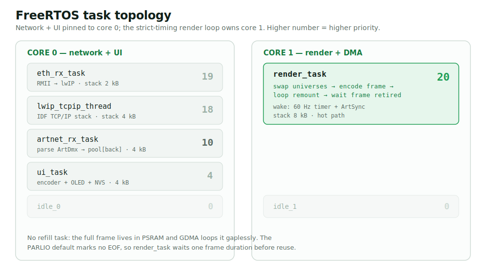
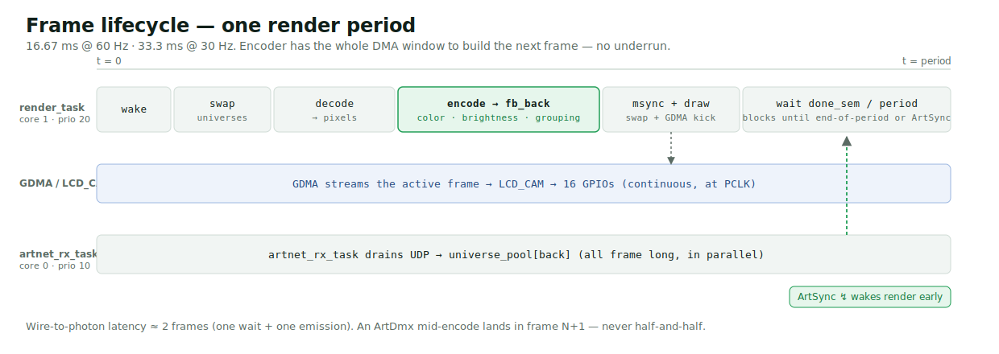

# pixfrog architecture

Reference for the software architecture of **pixfrog**, a high-performance 8-channel LED controller built on ESP32-P4 and driven by ArtNet over Ethernet.

> Normative document: every module respects what's described here, or amends this file before changing the design.

---

## 1. Overview

pixfrog is built around one principle: **decouple network ingest (bursty, jittery) from LED rendering (strict timing)** via multiple double-buffered stages. Each stage runs on a pinned core, shares only atomic pointers, and never allocates on the hot path.



**Key idea**: frame N+1 is encoded into `frame_buf[back]` (PSRAM) while GDMA streams frame N out of `frame_buf[front]`. The swap is a pointer exchange after `esp_cache_msync` + `esp_lcd_panel_draw_bitmap`. No underrun risk because the encoder has no sub-frame deadline: it has the full DMA emission window of the current frame to produce the next one.

---

## 2. Build framework

**Native ESP-IDF v5.5+ (CMake + `idf.py`).**

1. **Stable ESP32-P4 support** in upstream IDF. PlatformIO historically lags new targets by months.
2. **Low-level LCD_CAM access** through the `esp_lcd` RGB panel API — no abstraction in the way.
3. **Granular `sdkconfig`** for PSRAM, FreeRTOS, lwIP, IRAM ISR placement.
4. **Reproducible CI** via the official `espressif/idf:vX.Y` docker images.

Layout follows IDF conventions: `main/`, `components/`, `sdkconfig.defaults`, root `CMakeLists.txt`.

---

## 3. FreeRTOS task topology



| Task                 | Core | Prio | Stack | Wake source                   | Role                                              |
|----------------------|:----:|:----:|:-----:|-------------------------------|---------------------------------------------------|
| `lwip_tcpip_thread`  | 0    | 18   | 4 kB  | lwIP mailbox                  | IDF TCP/IP stack (provided)                       |
| `eth_rx_task`        | 0    | 19   | 2 kB  | Ethernet IRQ                  | RMII → lwIP (provided)                            |
| `artnet_rx_task`     | 0    | 10   | 4 kB  | blocking `lwip_recvfrom`      | Parse packets, write `universe_pool[back]`        |
| `render_task`        | 1    | 20   | 8 kB  | 60 Hz timer + `ArtSync`       | Swap universes, encode full frame to `fb_back`, draw_bitmap, wait `done_sem` |
| `ui_task`            | 0    | 4    | 4 kB  | encoder IRQ + 100 ms tick     | Boot splash, read encoder, render display (OLED or TFT), persist NVS |
| `idle_0` / `idle_1`  | 0/1  | 0    | 1 kB  | (FreeRTOS)                    | Power-save hooks                                  |

> **Note**: no `lcd_cam_refill_task`. The full frame buffer lives in PSRAM; GDMA scans it in one transaction, the `on_color_trans_done` ISR releases `done_sem` at the end. The encoder has no sub-frame deadline.

---

## 4. Frame lifecycle

A frame is the interval between two LED renders (33.33 ms at 30 Hz, 16.67 ms at 60 Hz).



When `render_task` wakes (t = 0), it runs, in order:

1. Atomic swap `universe_front ↔ universe_back`.
2. Per channel: decode universes → pixels (DMX offset, multi-universe spanning) into `pixel_back_buffer(ch)`, then `swap_pixels(ch)`.
3. `lcd::render_frame()`: encode every channel into `fb_back` in a single pass (`led::encode_frame` — pure stores, no pre-zeroing, color order / brightness / grouping / invert applied inline) **while the previous frame is still emitting from the other FB**, `esp_cache_msync(…, DIR_C2M)` on the written region, wait `done_sem`, then `esp_lcd_panel_draw_bitmap(panel, fb_back)` — which swaps the active FB and kicks GDMA. Encode (CPU) and emission (GDMA) overlap; the frame rate is bounded by max of the two, not their sum.
4. `dmx::wait_for_sync_or_period(remaining)`: block until end-of-period **or** an ArtSync arrives.

In parallel on core 0 across the whole frame, `artnet_rx_task` drains UDP into `universe_pool[back]`; an ArtSync calls `dmx::note_sync()`, which wakes `render_task` early via the semaphore.

**Total wire-to-photon latency**: typically 2 frames (one frame of wait + one frame of emission). At 30 Hz that's ~66 ms; at 60 Hz, ~33 ms — well below human perception for lighting.

**Consistency guarantee**: an ArtDmx received mid-encode lands in frame N+1, never half-and-half.

---

## 5. Memory budget

### Internal SRAM (768 kB total, ~512 kB usable)

| Item                                     | Size      | Note                                            |
|------------------------------------------|----------:|-------------------------------------------------|
| FreeRTOS + lwIP + IDF drivers            | ~120 kB   | Measured on similar projects                    |
| `pixel_buf[8]` (one scratch buf/channel) | 8 × 4 kB  | 1024 px × 4 bytes RGBW worst case               |
| All task stacks                          | ~30 kB    | cf. §3                                          |
| General heap                             | ~330 kB   | Ethernet init, NVS, OLED                        |

`pixel_buf` is a per-frame scratch buffer holding decoded DMX pixels before they're encoded into the PSRAM FB. No double-buffering needed: it's ephemeral.

### Octal PSRAM (32 MB)

| Item                              | Size       | Note                                                |
|-----------------------------------|-----------:|-----------------------------------------------------|
| `frame_buf[2]` (PSRAM)            | 2 × actual frame | sized to the longest configured channel (e.g. 512 px WS2815 → 2 × ~0.5 MB); hard cap 2 × ~2.6 MB (1024 px × 32 bits × 40 samples, WS2811-slow RGBW) |
| `universe_pool[2][N]`             | 2 × 48 kB  | 48 universes × 512 bytes × 2 buffers                |
| Circular logs                     | 64 kB      | Post-mortem debug                                   |
| Application headroom              | ~27 MB     | Future sequencer / FX engine / ...                  |

**GDMA from PSRAM** is supported natively by `esp_lcd_new_rgb_panel(flags.fb_in_psram=true)` on ESP32-P4. The shared DMA bus tolerates 32 MB/s sustained on 200 MHz octal PSRAM (peak ~200 MB/s, shared with cache and other masters — comfortable headroom). One `esp_cache_msync(DIR_C2M)` is required after CPU writes and before the GDMA kick.

`frame_buf` (and the panel's `h_res`, i.e. the DMA emission duration) tracks the actual config: the panel is recreated when a config commit changes the required frame length. Sizing to the worst case would pin the emission at 82 ms/frame (≈ 12 FPS) regardless of content.

### NVS

| Item                               | Size      |
|------------------------------------|----------:|
| Global config (IP, ArtNet, names)  | ~260 B    |
| Per-channel × 8                    | 8 × 64 B  |
| Total                              | < 1 kB    |

The standard 24 kB NVS partition is plenty.

---

## 6. Synchronization

pixfrog deliberately avoids mutexes on the hot path. All data-plane handoffs are **atomic pointer swaps**.

### 6.1 Pointer swap (universe_pool)

```cpp
std::atomic<UniverseBank*> universe_front;   // read by render_task
UniverseBank*              universe_back;    // written by artnet_rx_task

// render_task once per frame:
UniverseBank* new_front = universe_back;
universe_back = universe_front.exchange(new_front, std::memory_order_acq_rel);
// new_front is now the consistent snapshot for this frame
```

No locks. With one writer (`artnet_rx_task`) and one reader (`render_task` after swap), acquire/release ordering provides correctness.

### 6.2 Binary semaphore (end of DMA emission)

- LCD_CAM `on_color_trans_done` ISR → `xSemaphoreGiveFromISR(done_sem)`
- `render_task` → `xSemaphoreTake(done_sem, timeout)` before kicking the next frame

If the take times out, `dma_underruns` is incremented and we proceed with the next frame anyway — no error cascade.

### 6.3 ArtSync wake

- `dmx::note_sync()` is called from `artnet_rx_task` on ArtSync receipt; it gives `g_sync_sem`.
- `render_task::dmx::wait_for_sync_or_period(remaining)` blocks on the semaphore with a timeout; an ArtSync interrupts the wait so the next frame goes out immediately.

### 6.4 Event group (config dirty bits)

UI commits set bits in `g_remap_eg` (bit `n` per channel, bit 8 for global). `render_task` consumes them at the start of every frame via `dmx::handle_pending_remaps()`, which rebuilds the universe → channel LUT when needed.

### 6.5 NVS

NVS writes happen only from `ui_task` (low-prio, core 0). They can block for a few ms; the UI tolerates that latency. `render_task` reads the config via `config::get_channel()` which returns a reference to the RAM cache — never blocks.

---

## 7. ISRs and IRAM

All ISRs are `IRAM_ATTR`:

- LCD_CAM `on_color_trans_done` (only `xSemaphoreGiveFromISR`)
- seesaw encoder IRQ (same)
- Ethernet RX (IDF, already in IRAM)

Required sdkconfig flags: `CONFIG_LCD_CAM_ISR_IRAM_SAFE=y`, `CONFIG_GDMA_ISR_IRAM_SAFE=y`.

> The frame buffer lives in PSRAM (which goes through the CPU cache), but GDMA itself talks directly to PSRAM via the cache controller without CPU involvement. PSRAM placement is fine for the buffer; only the ISR code needs to be in IRAM.

---

## 8. Hot reconfiguration

Changing a channel's protocol can change:

1. Samples per bit (NRZ vs clocked encoding)
2. Required PCLK frequency (PCLK is global to LCD_CAM)
3. Pixel buffer size (RGB vs RGBW)

**Decision**: PCLK is **fixed at boot** to a compromise value (see `docs/PROTOCOLS.md` §3). Samples per bit are derived per channel without changing PCLK. Clocked protocols run at PCLK/N where N is computed to hit the requested CLOCK rate.

Consequence: **changing protocol at runtime never changes PCLK**. `render_task` swaps the channel's encoder descriptor between frames; the pixel buffers are sized for the worst case at boot. The one exception is the frame length: a config commit that moves the required sample count to a different bucket tears down and recreates the RGB panel (FB realloc included) — once per commit, between frames, never in steady state.

**DMX512 output** is a fourth encoder family alongside NRZ and clocked SPI. A
channel set to `DMX512` re-emits one Art-Net universe as a 250 kbit/s serial
stream (BREAK + MAB + 8N2 slots) on its DATA bit — see `docs/PROTOCOLS.md` §7.
It shares the same ingest path; only `bytes_per_pixel` (= 1) and the encoder
dispatch differ, so hot reconfiguration to/from DMX needs no special handling.
The channel's otherwise-unused CLOCK bit is driven as the complement of DATA to
form a `DATA+/DATA−` pair (a poor-man's differential link); a real RS-485
transceiver is still preferable for long or terminated runs — see
`docs/PROTOCOLS.md` §7.

---

## 9. Module map

| Component            | Responsibility                                      | Depends on              |
|----------------------|-----------------------------------------------------|-------------------------|
| `lcd_cam_output`     | LCD_CAM 16-bit driver, PSRAM FBs, GDMA, ISR        | IDF HAL only            |
| `led_protocols`      | Per-protocol encoders (NRZ, SPI-like, DMX512)      | (free)                  |
| `artnet`             | UDP parser, ArtPollReply, writes universe pool     | `lwip`                  |
| `dmx_manager`        | Universe pool + channel mapping + capacity check   | `artnet`, `config_store` |
| `config_store`       | NVS wrappers + RAM cache                           | IDF NVS                 |
| `ui`                 | Canvas API (OLED or TFT) + seesaw + menu FSM + splash | IDF I2C / SPI, `config_store`, `esp_lcd` (TFT only) |
| `boards/<hw>.h`      | Pinout, hardware capabilities                      | (header-only)           |

**Dependency rule**: `lcd_cam_output` knows nothing about ArtNet; `artnet` knows nothing about LCD_CAM. They meet in `main.cpp` via `dmx_manager`, which owns the pointer dance.

---

## 10. Logging and telemetry

Per-module ESP_LOG tags: `ARTNET`, `LCD_CAM`, `UI`, `DMX`, `CFG`, `MAIN`. Default level `INFO`, tunable at build time.

Internal counters exposed by `dmx_manager_get_stats()`:

```cpp
struct DmxStats {
    uint64_t frames_emitted;
    uint64_t artnet_packets_rx;
    uint64_t artnet_bad_packets;
    uint32_t dma_underruns;
    uint32_t current_fps;
};
```

Read by HOME. No web server, no Prometheus — by design the only network surface is ArtNet.

---

## 11. Security / robustness

- No WiFi → no RF attack surface.
- ArtNet exposes no configuration channel; the network can write DMX bytes only.
- NVS encryption deliberately off (no secrets stored).
- Hardware watchdog enabled; `render_task` is subscribed and kicks every frame.

---

## 12. Out of scope for v0

- Internal sequencer / FX engine
- sACN E1.31 (would slot in next to ArtNet)
- Web UI (would require a WiFi co-MCU)
- Inter-controller frame sync (PTP)
