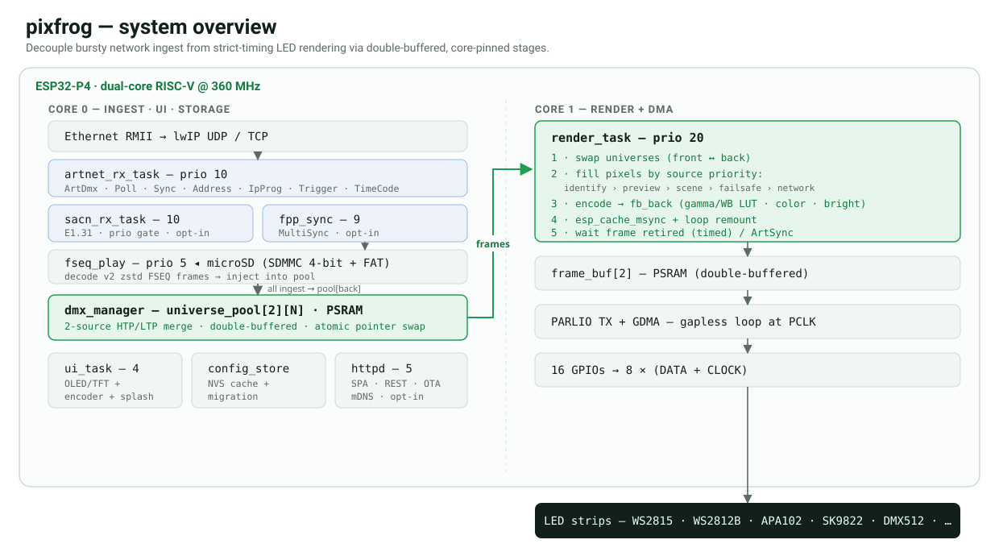
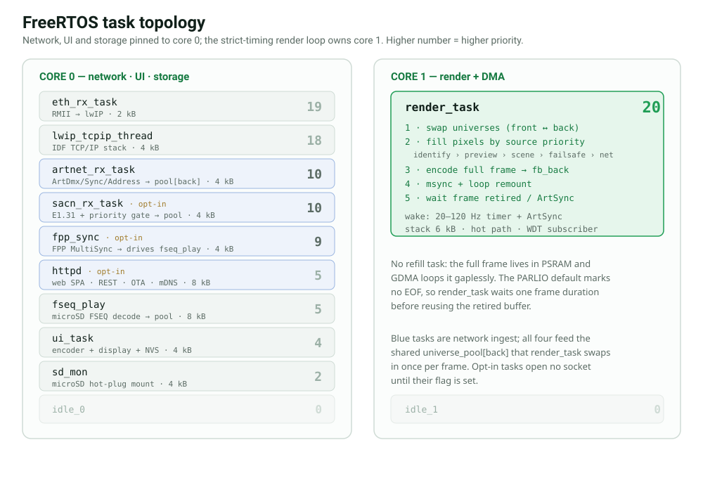
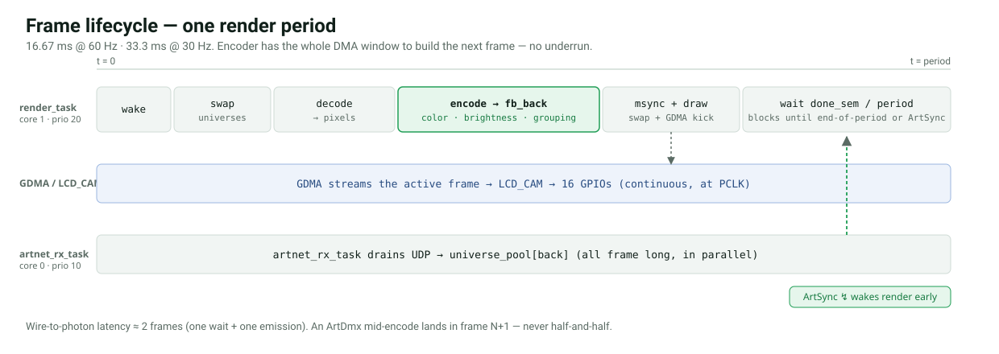

# pixfrog architecture

Reference for the software architecture of **pixfrog**, a high-performance 8-channel LED controller built on ESP32-P4 and driven by ArtNet over Ethernet.

> Normative document: every module respects what's described here, or amends this file before changing the design.

---

## 1. Overview

pixfrog is built around one principle: **decouple network ingest (bursty, jittery) from LED rendering (strict timing)** via multiple buffered stages (double-buffered universe and pixel banks, triple-buffered output frame). Each stage runs on a pinned core, shares only atomic pointers, and never allocates on the hot path.



**Key idea**: frame N+1 is encoded into `frame_buf[back]` (PSRAM) while GDMA streams frame N out of `frame_buf[front]`. After `esp_cache_msync`, the swap is a pointer exchange: the default **PARLIO TX backend** stitches the new buffer onto the tail of its gapless loop so it takes over at the next frame boundary (the legacy LCD_CAM backend re-arms with `esp_lcd_panel_draw_bitmap`). No underrun risk because the encoder has no sub-frame deadline: it has the full DMA emission window of the current frame to produce the next one.

---

## 2. Build framework

**Native ESP-IDF v5.5+ (CMake + `idf.py`).**

1. **Stable ESP32-P4 support** in upstream IDF. PlatformIO historically lags new targets by months.
2. **Low-level parallel-bus access** — the default PARLIO TX driver (and the legacy LCD_CAM `esp_lcd` RGB panel) clock the 16-bit bus straight from PSRAM via GDMA, with no framework abstraction in the way.
3. **Granular `sdkconfig`** for PSRAM, FreeRTOS, lwIP, IRAM ISR placement.
4. **Reproducible CI** via the official `espressif/idf:vX.Y` docker images.

Layout follows IDF conventions: `main/`, `components/`, `sdkconfig.defaults`, root `CMakeLists.txt`.

---

## 3. FreeRTOS task topology



| Task                 | Core | Prio | Stack | Wake source                   | Role                                              |
|----------------------|:----:|:----:|:-----:|-------------------------------|---------------------------------------------------|
| `lwip_tcpip_thread`  | 0    | 18   | 4 kB  | lwIP mailbox                  | IDF TCP/IP stack (provided)                       |
| `eth_rx_task`        | 0    | 19   | 2 kB  | Ethernet IRQ                  | RMII → lwIP (provided)                            |
| `artnet_rx_task`     | 0    | 10   | 4 kB  | blocking `lwip_recvfrom`      | Parse packets (Dmx/Poll/Sync/Address/IpProg/Trigger), write `universe_pool[back]` |
| `sacn_rx_task`       | 0    | 10   | 4 kB  | blocking `recvfrom` (1 s t/o) | **Opt-in.** E1.31 data + sync, multicast joins (5 s refresh), priority gate |
| `fpp_sync`           | 0    | 9    | 4 kB  | blocking `recvfrom`           | **Opt-in.** FPP MultiSync remote: master start/stop/seek of local FSEQ files |
| `fseq_play`          | 0    | 5    | 8 kB  | `vTaskDelayUntil` (step_time) | Per-playback: read/decompress FSEQ frames, inject into `universe_pool[back]` |
| `sd_mon`             | 0    | 2    | 4 kB  | 1 s tick                      | microSD hot-plug mount/unmount |
| `httpd`              | 0    | 5    | 8 kB  | TCP accept                    | **Opt-in.** Web SPA + REST API + OTA + backup/restore + live status (esp_http_server); mDNS `pixfrog.local` while running |
| `render_task`        | 1    | 20   | 6 kB  | refresh timer + `ArtSync`     | Swap universes, decode/generate pixels, encode full frame, kick DMA |
| `ui_task`            | 0    | 4    | 4 kB  | 33 ms tick                    | Boot splash, **time-polled** seesaw encoder (no IRQ — 4-wire harness), render display, persist NVS |
| `idle_0` / `idle_1`  | 0/1  | 0    | 1 kB  | (FreeRTOS)                    | Power-save hooks                                  |

> **Note**: no refill task. The full frame buffer lives in PSRAM and the DMA
> engine scans it autonomously. The default **PARLIO TX backend** runs in loop
> transmission: the mounted buffer repeats gaplessly and a frame swap is a
> single buffer remount at the next frame boundary. The legacy LCD_CAM backend
> (Kconfig choice, not CI-built) paces on its vsync ISR instead. Either way
> the encoder has no sub-frame deadline.

---

## 4. Frame lifecycle

A frame is the interval between two LED renders — `1/refresh_rate`, any integer rate from 20 to 120 Hz (50 ms … 8.33 ms; 16.67 ms at the default 60 Hz).



When `render_task` wakes (t = 0), it runs, in order:

1. Atomic swap `universe_front ↔ universe_back`.
2. `dmx::update_show_control()`: evaluate the DMX control universe (if
   enabled and heard within 3 s) from the bank just published — master,
   blackout, strobe and scene overrides follow the desk continuously; scene and
   FSEQ bands act when they change (FSEQ is posted to `fseq_player`, the render
   task never touches the SD card).
3. Per channel, fill `pixel_back_buffer(ch)` from the **first matching source**
   in a fixed priority chain, then `swap_pixels(ch)`:
   1. **Identify** — 2 Hz white blink (commissioning, auto-expires)
   2. **Pixel-count preview** — live ruler while the count is edited
   3. **The output's source** — each output plays its own scene or the live
      path ("zones": a scene claims the outputs of its mask, several run at
      once):
      - **Scene** — stateless parametric generator (11 effects, 1–4 colour
        palette, `dmx_logic.h` `fill_scene_pattern`) with the desk's
        overrides; overrides network until stopped
      - **Live path** — FSEQ, else **failsafe** (channel silent past the
        timeout: blackout / solid colour / scene; hold = decode the stale
        data), else **network decode** (DMX offset, multi-universe spanning)
      During a crossfade (`scene_fade_ms`, eased) the previous source renders
      into a 4 kB SRAM scratch buffer and is blended in.
   4. **Show control** — blackout / strobe gate, then the grand master
      (local × desk, 16-bit) scales the bytes. Identify and the ruler bypass it.
4. `output::render_frame()`: encode every channel into a drained back buffer in a single pass (`led::encode_frame` — pure stores, no pre-zeroing; **gamma/white-balance LUT**, color order, brightness, grouping and invert applied inline per pixel) **while previous frames are still emitting from the other FBs** (PARLIO keeps two buffers mounted in its DMA loop; the third is the one being encoded — see §4.4), `esp_cache_msync(…, DIR_C2M)` on the written region, then hand the buffer to the DMA engine (PARLIO loop remount, or draw_bitmap on the legacy LCD_CAM path). Encode (CPU) and emission (DMA) overlap; the frame rate is bounded by max of the two, not their sum.
5. `dmx::wait_for_sync_or_period(remaining)`: block until end-of-period **or** an ArtSync arrives.

In parallel on core 0 across the whole frame, `artnet_rx_task` drains UDP into `universe_pool[back]`; an ArtSync calls `dmx::note_sync()`, which wakes `render_task` early via the semaphore.

**Total wire-to-photon latency**: typically 2 frames (one frame of wait + one frame of emission). At 30 Hz that's ~66 ms; at 60 Hz, ~33 ms — well below human perception for lighting.

**Consistency guarantee**: an ArtDmx received mid-encode lands in frame N+1, never half-and-half.

---

## 5. Memory budget

### Internal SRAM (768 kB total, ~512 kB usable)

| Item                                     | Size      | Note                                            |
|------------------------------------------|----------:|-------------------------------------------------|
| FreeRTOS + lwIP + IDF drivers            | ~120 kB   | Measured on similar projects                    |
| `pixel_buf[8]` (double-buffered, per channel) | 8 × 2 × 4 kB | 1024 px × 4 bytes RGBW worst case            |
| All task stacks                          | ~30 kB    | cf. §3                                          |
| General heap                             | ~330 kB   | Ethernet init, NVS, OLED                        |

`pixel_buf` holds a channel's decoded DMX pixels before they're encoded into the PSRAM FB. It is double-buffered per channel (atomic front/back swap): the network decode writes the back buffer, swaps, and the encoder reads a stable front while the next decode runs.

### Octal PSRAM (32 MB)

| Item                              | Size       | Note                                                |
|-----------------------------------|-----------:|-----------------------------------------------------|
| `frame_buf[3]` (PSRAM)            | 3 × 2.6 MB | triple-buffered (PARLIO) so encode overlaps the two FBs in the DMA loop; allocated once at the cap (1024 px × 32 bits × 40 samples) and never resized, so nothing on the render path allocates. Legacy LCD_CAM sizes 2 FBs to the longest configured channel instead. |
| `universe_pool[2][N]`             | 2 × 48 kB  | 48 universes × 512 bytes × 2 buffers                |
| Circular logs                     | 64 kB      | Post-mortem debug                                   |
| Application headroom              | ~27 MB     | Future sequencer / FX engine / ...                  |

**GDMA from PSRAM** is native on ESP32-P4: the PARLIO TX unit (default) streams its frame buffers straight out of octal PSRAM, as does the legacy LCD_CAM panel (`esp_lcd_new_rgb_panel(flags.fb_in_psram=true)`). The shared DMA bus tolerates 32 MB/s sustained on 200 MHz octal PSRAM (peak ~200 MB/s, shared with cache and other masters — comfortable headroom). One `esp_cache_msync(DIR_C2M)` is required after CPU writes and before the GDMA kick.

The **DMA emission duration** tracks the actual config — pinning it at the worst case would mean 82 ms/frame (≈ 12 FPS) regardless of content. On PARLIO the buffers and the emission length have separate lifetimes:

- the three frame buffers are allocated **once at the cap** and never resized, so `render_task` never allocates (AGENT.md);
- the **TX unit** is recreated whenever the frame length changes, which is what actually sets the emitted length.

The unit has to be rebuilt because IDF's loop transmission wraps its DMA chain with `gdma_link_concat(link, -1, …)`, and a negative index resolves modulo `num_items` — the last *allocated* descriptor, not the last mounted one. `num_items` comes from `max_transfer_size` at unit creation, so a link list longer than the payload wraps from a descriptor the DMA never reaches: the chain ends and the FIFO starves, with `ESP_OK` returned throughout and every counter still reporting healthy frames. Recreating the unit costs a few KB of internal descriptors, against the megabytes of PSRAM that resizing the buffers used to churn on every pixel-count detent.

LCD_CAM has no such split — the frame length lives in the panel's timing registers — so it recreates the panel, frame buffers included, from inside `render_task`. That is one reason it is debug-only.

### NVS

| Item                               | Size      |
|------------------------------------|----------:|
| Global config (IP, ArtNet, names)  | ~260 B    |
| Per-channel × 8                    | 8 × 64 B  |
| Total                              | < 1 kB    |

The standard 24 kB NVS partition is plenty.

---

## 6. Synchronization

pixfrog deliberately avoids mutexes on the hot path. All data-plane handoffs are **atomic pointer swaps**.

### 6.1 Universe banks (front / back + dirty mask)

Two universe banks; `g_uni_front` (atomic pointer) is the one `render_task`
reads, the *back* bank is simply the other one — derived, never stored, so it
cannot go stale. Receivers write a slot into the back bank (seeded from the
front the first time it is touched since the last swap) and set its bit in
`g_uni_dirty`; `render_task` swaps once per frame, only when something is
dirty, so a universe nobody updated keeps its value (hold-last-look).

Resolving the back bank and writing into it must not straddle a swap, so both
sides take **`g_uni_swap_mux`**: the receivers (`artnet_rx` / `sacn_rx`,
priority 10), the FSEQ player for a whole frame (`inject_frame_begin/end`,
so a multi-universe frame is published by one swap), and `render_task`
(priority 20) for the pointer flip. That is a **priority inversion by design**:
the render task can wait for a lower-priority holder. It is bounded — a holder
does at most one universe's merge + 512-byte copy (an FSEQ frame: its
universes' copies), microseconds — and FreeRTOS mutexes inherit priority, so
the holder cannot be preempted by middle-priority work meanwhile.

### 6.2 Buffer-free wait (end of DMA emission)

The default **PARLIO TX backend** runs in loop mode and marks no DMA EOF, so
there is no completion interrupt. The buffer just retired by a swap is known
free exactly one frame duration after the swap was submitted; `render_frame()`
parks on that timed deadline before reusing it.

The legacy **LCD_CAM backend** does fire a completion ISR, so it waits on a
semaphore instead:

- LCD_CAM `on_color_trans_done` ISR → `xSemaphoreGiveFromISR(done_sem)`
- `render_task` → `xSemaphoreTake(done_sem, timeout)` before kicking the next frame

Either way, if the wait expires `dma_underruns` is incremented and the next
frame proceeds anyway — no error cascade.

### 6.3 ArtSync wake

- `dmx::note_sync()` is called from `artnet_rx_task` on ArtSync receipt; it gives `g_sync_sem`.
- `render_task::dmx::wait_for_sync_or_period(remaining)` blocks on the semaphore with a timeout; an ArtSync interrupts the wait so the next frame goes out immediately.

### 6.4 Event group (config dirty bits)

UI commits set bits in `g_remap_eg` (bit `n` per channel, bit 8 for global). `render_task` consumes them at the start of every frame via `dmx::handle_pending_remaps()`, which rebuilds the universe → channel LUT when needed.

### 6.5 Config store and NVS

Config writes come from several tasks: `ui_task`, the UART console, `httpd`,
and `artnet_rx` (ArtAddress / ArtIpProg). Every setter takes one **recursive
config lock**, so writers never interleave inside a struct; a caller's
read-modify-write (`get_*` → change a field → `set_*`) holds a
`config::ScopedLock` across it so another task's write cannot be lost in
between. Writes go through to NVS under the lock and can take a few ms.

`render_task` never takes that lock: it reads the RAM cache by reference, and
copies the scenes it draws with `config::copy_scene()`, a **seqlock** over the
scene bank — a list edit (memmove) bumps a counter around the RAM change and
the reader retries if it overlapped, falling back to the lock only if a writer
keeps getting in the way. NVS blobs carry a layout version (`v_<key>`) next to
them; one written by a newer firmware is ignored rather than misread.

---

## 7. ISRs and IRAM

All ISRs are `IRAM_ATTR`:

- Ethernet RX (IDF, already in IRAM)
- LCD_CAM `on_color_trans_done` → `xSemaphoreGiveFromISR(done_sem)` — **legacy
  backend only**; the default PARLIO loop backend marks no DMA EOF and takes no
  per-frame completion interrupt.

(The seesaw encoder is time-polled on the 4-wire harness — no IRQ.)

Required sdkconfig flags: `CONFIG_GDMA_ISR_IRAM_SAFE=y` (both backends), plus
`CONFIG_LCD_CAM_ISR_IRAM_SAFE=y` on the legacy LCD_CAM path.

> The frame buffer lives in PSRAM (which goes through the CPU cache), but GDMA itself talks directly to PSRAM via the cache controller without CPU involvement. PSRAM placement is fine for the buffer; only the ISR code needs to be in IRAM.

---

## 8. Hot reconfiguration

Changing a channel's protocol can change:

1. Samples per bit (NRZ vs clocked encoding)
2. Required PCLK frequency (one PCLK clocks the whole 16-bit bus)
3. Pixel buffer size (RGB vs RGBW)

**Decision**: PCLK is **fixed at boot** to a compromise value (see `docs/PROTOCOLS.md` §3). Samples per bit are derived per channel without changing PCLK. Clocked protocols run at PCLK/N where N is computed to hit the requested CLOCK rate.

Consequence: **changing protocol at runtime never changes PCLK**. `render_task` swaps the channel's encoder descriptor between frames; the pixel buffers are sized for the worst case at boot. The one exception is the frame length: a config commit that moves the required sample count to a different bucket tears down and recreates the output unit (FB realloc included) — once per commit, between frames, never in steady state.

DMX512 output (formerly a fourth encoder family) was removed: it lives in
the DMX node firmware (a separate project forked from this one).

---

## 9. Module map

| Component            | Responsibility                                      | Depends on              |
|----------------------|-----------------------------------------------------|-------------------------|
| `led_output`     | 16-bit bus output: PARLIO TX loop (default) or legacy LCD_CAM; PSRAM FBs, gamma-LUT cache | IDF HAL, `led_protocols`, `dmx_manager` |
| `led_protocols`      | Per-protocol encoders (NRZ, SPI-like) + gamma/WB LUT builder         | (free)        |
| `artnet`             | UDP parser, Dmx/Poll/Sync/Address/IpProg/Trigger, replies | `lwip`, `dmx_manager` |
| `sacn`               | E1.31 receiver: multicast joins, priority gate, sync | `lwip`, `dmx_manager`  |
| `dmx_manager`        | Universe pool, 2-source HTP/LTP merge, channel mapping, capacity check, scenes/failsafe/identify state | `config_store` |
| `fseq_player`        | microSD FSEQ show playback: SDMMC 4-bit + FAT mount/hot-plug, v2 zstd frame decode, pacing, inject into pool; ArtTimeCode / FPP seek hooks | `config_store`, `dmx_manager`, `sdmmc`, `fatfs` |
| `fpp_sync`           | Opt-in FPP MultiSync remote (UDP 32320 + multicast): master START/STOP/SYNC drive the local FSEQ player | `lwip`, `fseq_player` |
| `config_store`       | NVS wrappers + RAM cache + forward migration + web password hash | IDF NVS, mbedtls |
| `web_config`         | Opt-in HTTP server: SPA, REST, OTA, backup/restore, Basic auth | esp_http_server, `app_update` |
| `ui`                 | Canvas API (OLED or TFT) + seesaw + menu FSM + splash | IDF I2C / SPI, `config_store`, `esp_lcd` (TFT only) |
| `control_console`    | UART0 REPL: full config, telemetry, DMX injection  | esp_console             |
| `boards/<hw>.h`      | Pinout, hardware capabilities                      | (header-only)           |

**Dependency rule**: `led_output` knows nothing about ArtNet; `artnet` knows nothing about LCD_CAM. They meet in `main.cpp` via `dmx_manager`, which owns the pointer dance.

---

## 10. Logging and telemetry

Per-module ESP_LOG tags: `ARTNET`, `PARLIO_OUT` / `LCD_CAM` (active backend), `UI`, `DMX`, `CFG`, `MAIN`. Default level `INFO`, tunable at build time.

Internal counters exposed by `dmx_manager_get_stats()`:

```cpp
struct Stats {
    uint64_t frames_emitted;
    uint64_t artnet_packets_rx;   // ArtDmx routed to a mapped universe
    uint64_t artnet_bad_packets;  // malformed (ArtNet or sACN)
    uint64_t artnet_ctrl_rx;      // ArtAddress/IpProg/Nzs/Trigger/Command/TimeCode
    uint64_t sacn_packets_rx;     // sACN data routed to a mapped universe
    uint32_t dma_underruns;
    uint32_t current_fps;
};
```

Read by HOME, the UART console (`stats`) and `/api/config`.

---

## 11. Security / robustness

- No WiFi → no RF attack surface.
- The only always-on listener is ArtNet UDP. sACN (UDP 5568) and the web UI
  (TCP 80) are strictly opt-in — no socket while disabled.
- ArtNet *can* reconfigure the node (ArtAddress/ArtIpProg, per Art-Net 4) and
  trigger scenes (ArtTrigger) — standard desk-side behaviour.
- Web mutations (config, OTA, reboot) sit behind optional HTTP Basic auth;
  the password is stored as a salted SHA-256, never in clear, and the UART
  console is the physical recovery channel.
- OTA uses A/B slots with BOOTLOADER_APP_ROLLBACK: a new image confirms
  itself only after 30 s of a live render loop (`ota_confirm_task`), so one
  that crashes or hangs early is reverted on the next reset; a power cut
  mid-upload never touches the running slot. Every rollback is logged at boot
  and kept as an NVS record (rejected version/slot, reset reason) shown by the
  web dashboard banner, `/api/diag` and the console `version` until
  acknowledged (`POST /api/rollback/ack`, `rollback ack`).
- Hardware watchdog enabled; `render_task` is subscribed and kicks every frame.

---

## 12. Out of scope (see TODO.md for the live list)

- RDM (over ArtNet or on the wire)
- Inter-controller frame sync (PTP)

Formerly listed here and since shipped: sACN E1.31, the web UI (native on the
P4 — no co-MCU needed), the scene/FX engine, the FSEQ player from microSD
(plus ArtTimeCode / FPP MultiSync slaving), and the 2-source HTP/LTP merge.
