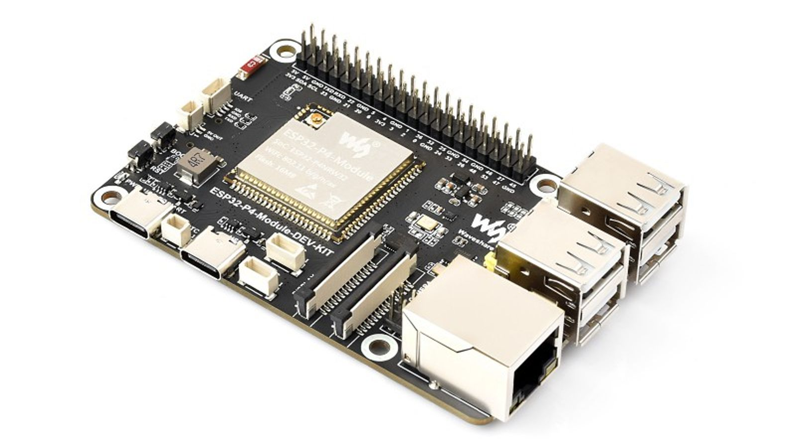
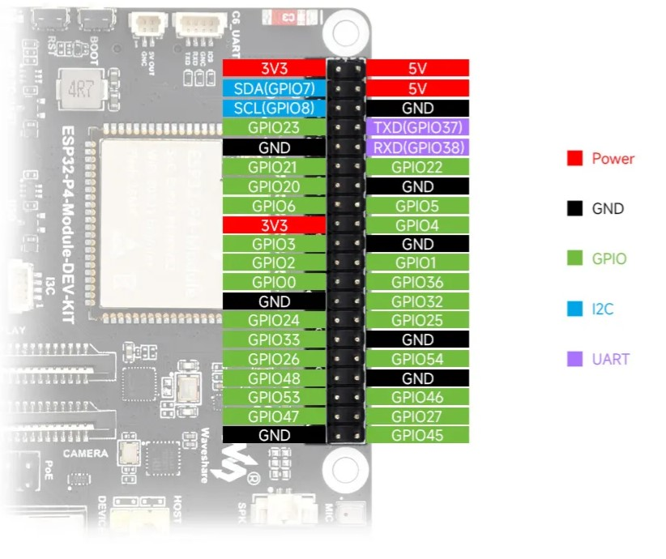
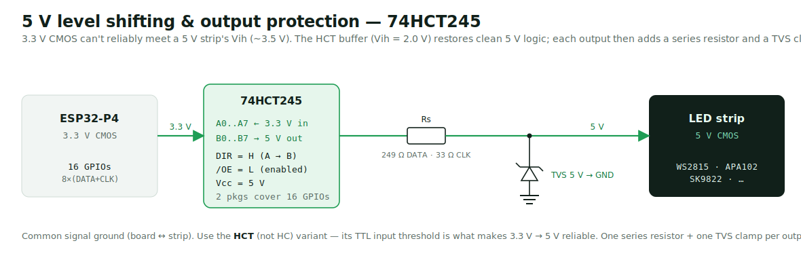
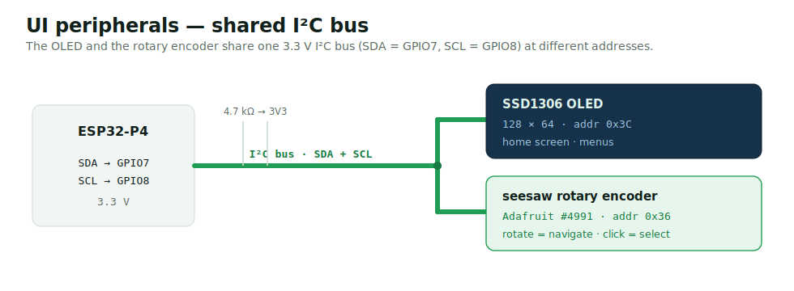
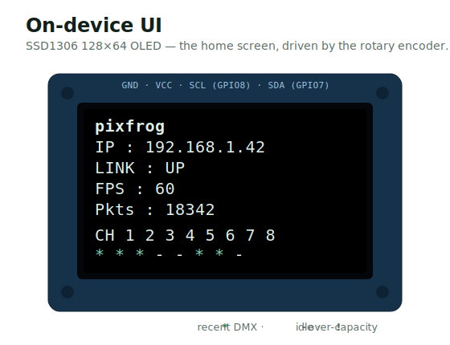
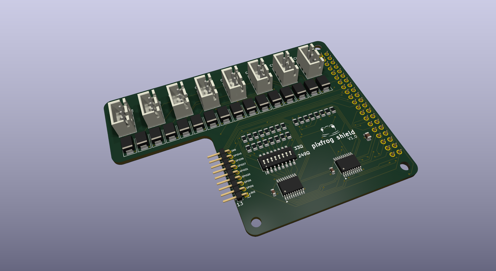
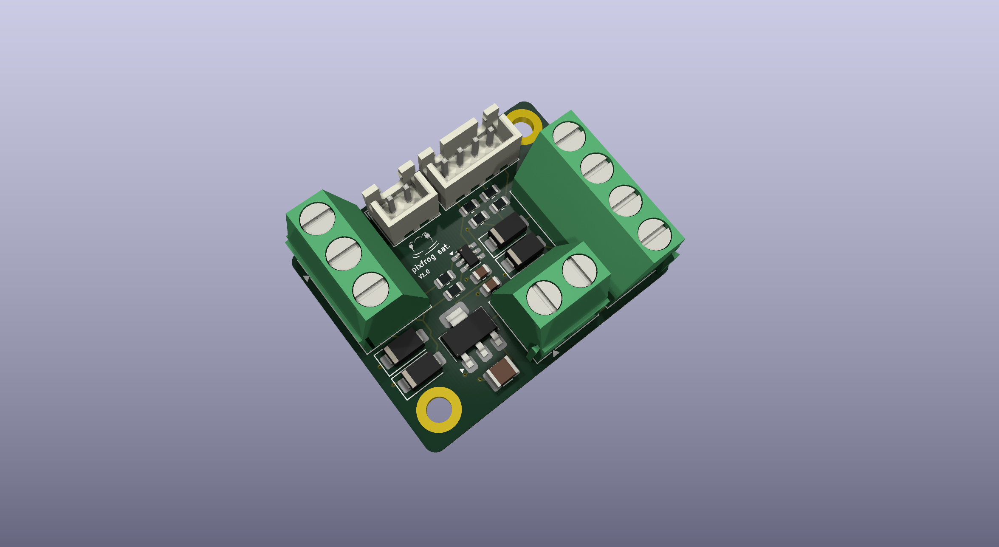

# pixfrog hardware

Target board for v0: **Waveshare ESP32-P4 Module DEV-KIT**.

Full schematic, pinout, datasheet and accessory documentation:

→ <https://docs.waveshare.com/ESP32-P4-Module-DEV-KIT/Resources-And-Documents>

All pin assignments in this document are exposed on the user-facing header connector documented by Waveshare; nothing collides with the internal Ethernet PHY (IP101GRI), PSRAM, or flash signals.

---

## 1. Board overview



- ESP32-P4 dual-core RISC-V @ 360 MHz
- 32 MB octal PSRAM
- 16 MB external flash
- **IP101GRI Ethernet PHY** with onboard magnetic RJ45 jack (RMII pre-wired)
- USB-C OTG + UART debug bridge
- Header connector exposes the user GPIOs in the layout shown below

External components added for pixfrog:

- 1 × SSD1306 I2C OLED 128×64
- 1 × Adafruit seesaw QT rotary encoder #4991
- 2 × 74HCT245 level shifters (3.3 V → 5 V) — one per group of 8 GPIOs
- 8 × strip output connectors (DATA, CLOCK, GND)

---

## 2. Pinout



Validated against the Waveshare ESP32-P4 Module DEV-KIT schematic (P6 40-pin header). Strapping pins latched at reset (ESP32-P4 datasheet §3.3): **GPIO 35** (boot/download select, driven by the on-board BOOT button — also doubles as RMII TXD1), **GPIO 36** (must read HIGH for a reliable serial-download boot — exposed on P6 pin 21, keep it free), **GPIO 34** (JTAG source select). None of the LED pins below land on a strapping pin. GPIO 16 is not exposed on P6 and must not be used.

### 2.1 LED 16-bit parallel bus (PARLIO TX / LCD_CAM)

ESP32-P4 routes every peripheral signal through the GPIO matrix, including the 16 data lines of the parallel LED bus. Any free GPIO is a valid bus data line — the choices below pick header pins that are easy to route in pairs. The bus is driven by the default **PARLIO TX** backend or the legacy **LCD_CAM** RGB backend (Kconfig choice); both clock the same 16 GPIOs from PSRAM via GDMA and emit identical sample streams (see `docs/PROTOCOLS.md` §3).

| Bus bit | Signal    | GPIO | Notes                       |
|--------:|-----------|-----:|-----------------------------|
| 0       | CH1_DATA  | 2    | strip 1 data                |
| 1       | CH1_CLOCK | 3    | strip 1 clock (clocked LEDs)|
| 2       | CH2_DATA  | 4    |                             |
| 3       | CH2_CLOCK | 5    |                             |
| 4       | CH3_DATA  | 22   |                             |
| 5       | CH3_CLOCK | 23   |                             |
| 6       | CH4_DATA  | 24   |                             |
| 7       | CH4_CLOCK | 25   |                             |
| 8       | CH5_DATA  | 26   |                             |
| 9       | CH5_CLOCK | 46   | P6 pin 33 (adj. to CH5_DATA)|
| 10      | CH6_DATA  | 32   |                             |
| 11      | CH6_CLOCK | 33   |                             |
| 12      | CH7_DATA  | 47   |                             |
| 13      | CH7_CLOCK | 48   |                             |
| 14      | CH8_DATA  | 53   |                             |
| 15      | CH8_CLOCK | 54   |                             |

> The bus clock (PCLK) pin stays internal on both backends — LCD_CAM with `pclk_gpio_num = -1`, PARLIO with `clk_out_gpio_num = GPIO_NUM_NC`. CLOCK signals for clocked LED protocols (APA102, …) are encoded as bits 1, 3, 5, … of the parallel sample stream, not derived from PCLK. See `docs/PROTOCOLS.md` §3.

### 2.2 Ethernet RMII (internal)

The PHY's RMII + management pins use fixed SoC GPIOs that are wired directly on the DEV-KIT (verified against the schematic, PHY U7 = IP101GRI) and are not brought out to the P6 header, so they impose no constraint on the LED bus pinout above. The RMII data/clock pins equal the IDF v5.5 `ETH_ESP32_EMAC_DEFAULT_CONFIG()` defaults, which match the board wiring — so `main/init_network()` only overrides MDC / MDIO / reset:

| Signal RMII   | GPIO P4 | Note                                  |
|---------------|--------:|---------------------------------------|
| EMAC_REF_CLK  | 50      | 50 MHz, fixed                         |
| EMAC_TX_EN    | 49      | fixed                                 |
| EMAC_TXD0     | 34      | fixed (also a boot strap)             |
| EMAC_TXD1     | 35      | fixed (also the BOOT-button strap)    |
| EMAC_RXD0     | 29      | fixed                                 |
| EMAC_RXD1     | 30      | fixed                                 |
| EMAC_CRS_DV   | 28      | fixed                                 |
| MDC           | 31      | U7 pin 22                             |
| MDIO          | 52      | U7 pin 23                             |
| PHY reset     | 51      | U7 pin 32 — drive HIGH to release     |
| PHY address   | 0x01    | IP101GRI strap (AD0/AD3)              |

> The old MDC=29 / MDIO=30 values were carried over from the Espressif Function EV Board and never link on the Waveshare DEV-KIT — GPIO 29/30 are actually the RMII RX data lines there. Use the values above.

### 2.3 I2C (OLED + encoder)

| Signal | GPIO | Note                                             |
|--------|-----:|--------------------------------------------------|
| SDA    | 7    | `SDA(GPIO7)` on the header silkscreen           |
| SCL    | 8    | `SCL(GPIO8)` on the header silkscreen           |

I2C addresses:

- SSD1306: `0x3C` or `0x3D` (depending on module)
- seesaw 4991: `0x36` (factory default)

Bus frequency: **400 kHz** (Fast Mode). Enough for OLED refresh at ~10 Hz with diff-based flushing.

### 2.4 Miscellaneous

| Signal       | GPIO | Note                                       |
|--------------|-----:|--------------------------------------------|
| STATUS_LED   | 1    | optional external heartbeat                |
| DEBUG_TX     | 37   | UART0 console — `TXD(GPIO37)` on silkscreen |
| DEBUG_RX     | 38   | UART0 — `RXD(GPIO38)`                       |

### 2.5 microSD (SDMMC 4-bit)

The FSEQ player reads `.fseq` shows from a microSD card on the SDMMC 4-bit bus:

| Signal | GPIO | Signal | GPIO |
|--------|-----:|--------|-----:|
| CLK    | 39   | D0     | 41   |
| CMD    | 40   | D1     | 42   |
|        |      | D2     | 43   |
|        |      | D3     | 44   |

None of these GPIOs appear in the LED bus, SPI display, I2C, Ethernet or UART pin lists.

### 2.6 Pad power domains (VDD_IO_5 LDO)

GPIO 39–48 sit in the **VDD_IO_5** pad domain, powered by the SoC's internal LDO output **VO4**. Left unprogrammed, VO4 idles near **1.2 V**, so those pads only swing ~1.2 V — not enough to drive a 5 V buffer or an SD card. `main::power_vdd_io5_pads()` programs VO4 to **3.3 V** at boot. This domain covers **CH5 CLOCK (46)**, **CH7 DATA/CLOCK (47/48)** and the entire **microSD** bus (39–44), so the LDO step is mandatory for those outputs.

---

## 3. Level shifters

The SoC drives **3.3 V CMOS**. 5 V strips have variable thresholds:

| Strip               | Vih @ Vcc=5 V              | 3.3 V direct OK? |
|---------------------|----------------------------|------------------|
| WS2815              | typ 0.7 × Vcc = 3.5 V      | **No** — borderline |
| WS2812B             | typ 0.7 × Vcc = 3.5 V      | No (same)        |
| WS2811              | 0.7 × Vcc = 3.5 V          | No               |
| SK6812              | 0.65 × Vcc = 3.25 V        | Marginal         |
| APA102 / SK9822     | 0.7 × Vcc = 3.5 V          | No               |

**Decision**: level shifters are mandatory for production. For early bring-up with short strips (< 30 LEDs) near the PSU, the first WS2815 often regenerates the signal — fine for a scope test, not for shipping.

**Part**: **74HCT245** (8 bits per package, two packages cover all 16 GPIOs). The `HCT` (not HC) variant is critical: Vih = 2.0 V (CMOS-to-TTL threshold), guarantees clean switching from 3.3 V CMOS into a 5 V CMOS strip.



Realised as the **pixfrog shield** (see §8, *Hardware boards*, below).

---

## 4. Encoder wiring (Adafruit seesaw 4991)



Everything is over I2C:

```
seesaw 4991       ESP32-P4
─────────────     ──────────
Vin (3-5 V)  ───► 3.3 V
GND          ───► GND
SDA          ───► GPIO 7  (I2C SDA)
SCL          ───► GPIO 8  (I2C SCL)
INT          ───► not connected (see below)
ADR (option) ───► float → address 0x36
SS (option)  ───► unused (I2C only)
```

The seesaw INT_N line is **deliberately unused** — a 4-wire harness
(VCC/GND/SDA/SCL) is all the encoder needs:

- `ui_task` already loops at ~30 Hz for the encoder-LED animation and the
  diff-based display refresh, so time-polling adds at most one tick (~33 ms)
  of input latency — imperceptible on a rotary detent.
- Skipping the interrupt machinery removes two extra I2C reads per poll
  (the `GPIO_INTFLAG` + `ENCODER_DELTA` latch clears the seesaw requires to
  re-arm INT_N).

Firmware path: `ui_task` polls position + button over I2C every ~33 ms and
queues RotateLeft/RotateRight/Click/LongPress events into the menu FSM.
GPIO 21 (previously reserved for INT) is free.

Reference: [Adafruit Learn — I2C QT Rotary Encoder](https://learn.adafruit.com/adafruit-i2c-qt-rotary-encoder).

---

## 5. TFT display wiring (ST7789V / ILI9341 — default)

The default display is a **ST7789V (or pin-compatible ILI9341) 320×240 SPI display** (`CONFIG_PIXFROG_DISPLAY_TFT`, selected by default). The TFT is driven in landscape orientation (320 wide × 240 tall) via `esp_lcd_new_panel_st7789`.

```
ST7789V module    ESP32-P4
──────────────    ─────────
VCC (3.3 V)  ───► 3.3 V
GND          ───► GND
CLK (SCLK)   ───► GPIO 0
MOSI (SDA)   ───► GPIO 6
CS           ───► GPIO 20
DC (RS)      ───► GPIO 21
RST          ───► GPIO 27
```

These five signals are broken out on the shield's **J13** header. They replace
the original GPIO 9-13 mapping, which reused the on-board ES8311 codec's I2S
pins — those are **not** exposed on the connector/shield. All five chosen GPIOs
are free, 3.3 V-direct and non-strapping; every signal routes through the GPIO
matrix, so the assignment is arbitrary among the free pins. J13 also exposes
GPIO 36 (a boot strapping pin — must read HIGH at reset) and GPIO 45 (VDD_IO_5 /
LDO-VO4 domain), both left as spares. There is no MISO (write-only panel) and no
backlight control pin.

SPI host: `SPI2_HOST`, **20 MHz** (`kDisplaySpiFreqHz`). 40 MHz is rejected by
the P4 SPI driver (`invalid sclk speed` — the default clock source can't derive
it); 20 MHz is a clean divisor and ample for the 320×240 panel. The display is portrait 240×320 at
the hardware level; firmware issues `esp_lcd_panel_swap_xy(true)` after init to
address it as landscape 320×240.

Color format: RGB565 big-endian (ST7789 native). `canvas_tft.cpp` applies `__builtin_bswap16` to every pixel value before writing to the DMA buffer.

The TFT and OLED share the same I2C encoder wiring (§4 above). The I2C bus is still initialised regardless of display choice (encoder requires it).

---

## 6. OLED display (SSD1306 — optional)

The alternative display is a **SSD1306 128×64 I²C OLED** (`CONFIG_PIXFROG_DISPLAY_OLED`). It shares the I²C bus with the encoder (§2.3) — no dedicated wiring beyond that bus. Refresh is **10 Hz** via diff-based flush (only the pages whose pixels changed are pushed).



---

## 7. Power

- ESP32-P4 + 3.3 V logic: LDO or DC-DC on the DEV-KIT (already done).
- Signal ground must be common between the board and the strips — each shield
  output carries a GND pin alongside its DATA/CLOCK pair.

---

## 8. Hardware boards

Two KiCad 10 projects under [`hardware/`](https://github.com/Lefix2/pixfrog/tree/main/hardware) take the LED bus from the
3.3 V SoC out to the strips. They are independent and complementary — the shield
conditions the bus at the controller; add a satellite at the far end of a long
run to keep the signal and the strip voltage clean over distance:

```
controller / devkit ──2×20 header──► pixfrog shield ──long cable──► pixfrog satellite ──► LED strip
      3.3 V GPIOs                     level-shift + protect          repeat + power inject
```

### pixfrog shield — bus conditioning at the controller

[`hardware/pixfrog_shield/`](https://github.com/Lefix2/pixfrog/tree/main/hardware/pixfrog_shield) — plugs onto
the devkit's 2×20 header and re-drives all 16 bus lines at 5 V through 2× 74HCT245
(the level shifter of §3 realised), with DIP-selectable series termination, a 5 V
TVS clamp per output and 8× JST-XH (DATA/CLOCK/GND). It also breaks out the TFT
display and the spare GPIOs on its J13 header (§5).



### pixfrog satellite — remote repeater + power injection

[`hardware/pixfrog_satellite/`](https://github.com/Lefix2/pixfrog/tree/main/hardware/pixfrog_satellite) — sits at
the **far end of a long run**. A 74LVC2G17 Schmitt buffer re-squares one channel's
two lines and a local LD1117 (12 V or 24 V build) injects strip power, so the LEDs
see fresh edges and full voltage regardless of cable length. The 249 Ω / 39 Ω
series-impedance select (header J4) mirrors the shield's SW1.



---

## 9. Future hardware (v1, custom PCB)

An all-in-one board folding the shield's conditioning onto the SoC carrier:

- 2-layer PCB minimum, continuous ground plane
- Dedicated 1 A LDO for the 3.3 V rail
- Isolated DC-DC for the level shifters if the run to the strips exceeds ~30 cm
- 8 × JST-XH 3-pin connectors per channel (DATA, CLOCK, GND)
- Front-panel Ethernet jack
- Passive aluminium heatsink — octal PSRAM dissipates at full throughput
