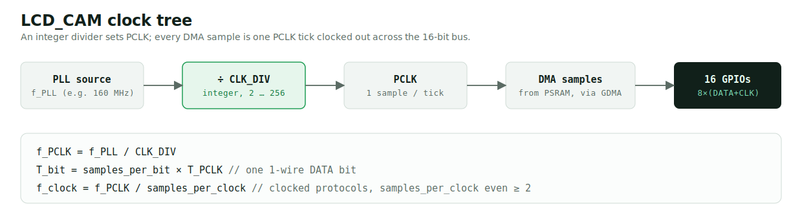
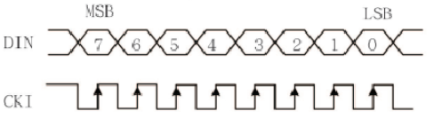

# LED protocols — pixfrog

Reference for timings, clock formulas and DMA encoding for every protocol pixfrog supports.

> Any deviation from the values in this document must be justified and verified on a scope.

---

## 1. Supported protocols

| Protocol | Family    | Bit-rate / max CLOCK | Default order | Bits/pixel | Notes                       |
|----------|-----------|----------------------|---------------|-----------:|-----------------------------|
| WS2815   | 1-wire NRZ | 800 kbps             | GRB           | 24         | Primary target, robust signal |
| WS2812B  | 1-wire NRZ | 800 kbps             | GRB           | 24         | Near-identical to WS2815    |
| WS2811   | 1-wire NRZ | 400 or 800 kbps      | RGB           | 24         | Slow or fast variant        |
| SK6812   | 1-wire NRZ | 800 kbps             | GRB or GRBW   | 24 or 32   | Common RGBW variant         |
| WS2814   | 1-wire NRZ | 800 kbps             | RGBW          | 32         | Dedicated white channel     |
| APA102   | SPI-like   | 1–30 MHz CLOCK       | BGR           | 32 (start + brightness + BGR) | 5-bit hardware brightness |
| SK9822   | SPI-like   | 1–30 MHz CLOCK       | BGR           | 32         | APA102-compatible timing    |
| LPD8806  | SPI-like   | 1–20 MHz CLOCK       | GRB           | 24         | MSB of every byte must be 1 |
| DMX512   | async serial | 250 kbps           | —             | 8 / slot   | Raw 1-universe output (see §7) |

---

## 2. 1-wire NRZ timings

Typical values in nanoseconds. T0H = high time encoding a `0`, T1H = high time encoding a `1`, etc. TRESET = low time required between frames for the strip to latch.


| Protocol      | T0H  | T0L  | T1H  | T1L  | TDATA (T0H+T0L = T1H+T1L) | TRESET   |
|---------------|-----:|-----:|-----:|-----:|---------------------------:|---------:|
| WS2815        | 300  | 950  | 950  | 300  | 1 250                      | ≥ 280 µs |
| WS2812B       | 350  | 800  | 700  | 600  | 1 250                      | ≥ 50 µs  |
| WS2811-fast   | 350  | 800  | 700  | 600  | 1 250                      | ≥ 50 µs  |
| WS2811-slow   | 700  | 1 600 | 1 200 | 1 300 | ~2 500                  | ≥ 50 µs  |
| SK6812        | 300  | 900  | 600  | 600  | 1 200                      | ≥ 80 µs  |
| WS2814        | 300  | 950  | 950  | 300  | 1 250                      | ≥ 280 µs |

Datasheet tolerance is typically ±150 ns per sub-time. pixfrog aims for the middle of the tolerance window for cross-batch compatibility.

---

## 3. LCD_CAM clock formula

### 3.1 Clock tree



Formulas:

```
f_PCLK   = f_PLL_source / CLK_DIV         CLK_DIV ∈ {2, 3, …, 256}
T_PCLK   = 1 / f_PCLK                     period of one DMA sample
T_bit    = samples_per_bit × T_PCLK       duration of one 1-wire DATA bit
```

For clocked protocols:

```
T_clock_cycle = samples_per_clock × T_PCLK
f_clock_out   = 1 / T_clock_cycle = f_PCLK / samples_per_clock
```

where `samples_per_clock` is even and ≥ 2 (half low, half high).

### 3.2 PCLK choice for pixfrog

Criterion 1: cover WS2815 timing (T0H = 300 ns, T1H = 950 ns) with tight granularity.
Criterion 2: support useful APA102 CLOCK rates (≥ 1 MHz, ideally 6+ MHz).
Criterion 3: keep the DMA bus load below 30 % of PSRAM bandwidth.

**Chosen value**: `f_PCLK = 16 MHz`, so `T_PCLK = 62.5 ns`.

1-wire verification:

| Target (ns) | Ideal samples | Chosen samples | Realised (ns) | Error    |
|-------------|--------------:|---------------:|--------------:|---------:|
| T0H = 300   | 4.8           | 5              | 312.5         | +12.5 ns |
| T0L = 950   | 15.2          | 15             | 937.5         | −12.5 ns |
| T1H = 950   | 15.2          | 15             | 937.5         | −12.5 ns |
| T1L = 300   | 4.8           | 5              | 312.5         | +12.5 ns |
| TDATA       | 20            | 20 (= T0H+T0L) | 1 250         | 0        |

→ `samples_per_bit = 20` for WS2815, total bit = 1 250 ns. ✓

Clocked verification:

```
samples_per_clock = 2   → f_clock = 8 MHz   (APA102 at 8 MHz, OK)
samples_per_clock = 4   → f_clock = 4 MHz
samples_per_clock = 8   → f_clock = 2 MHz
samples_per_clock = 16  → f_clock = 1 MHz
```

Reachable CLOCK range: **125 kHz to 8 MHz** in integer divisor steps. Plenty for real-world use (APA102 is reliable at 4–8 MHz on ~100 LED strings).

### 3.3 Other 1-wire protocols at PCLK = 16 MHz

| Protocol     | T0H target | T1H target | Samples T0H | Samples T1H | Samples / bit | Max error |
|--------------|----------:|-----------:|------------:|------------:|--------------:|----------:|
| WS2815       | 300       | 950        | 5           | 15          | 20            | ±13 ns    |
| WS2812B      | 350       | 700        | 6           | 11          | 20            | ±25 ns    |
| WS2811-fast  | 350       | 700        | 6           | 11          | 20            | ±25 ns    |
| WS2811-slow  | 700       | 1 200      | 11          | 19          | 40            | ±25 ns    |
| SK6812       | 300       | 600        | 5           | 10          | 19 (~1 187 ns) | ±13 ns   |
| WS2814       | 300       | 950        | 5           | 15          | 20            | ±13 ns    |

All errors are under the ±150 ns datasheet tolerance. ✓

---

## 4. DMA encoding (1-wire vs clocked)

The DMA buffer is a stream of 16-bit samples. In each sample, each bit is the state of one GPIO at that PCLK tick.

```
sample[t] = (CH8_CLOCK << 15) | (CH8_DATA << 14) | … | (CH1_CLOCK << 1) | CH1_DATA
```

### 4.1 1-wire NRZ encoding (WS2815, samples_per_bit = 20)

To encode a `1` on CH1_DATA:

```
sample[0]   : CH1_DATA = 1
sample[1]   : CH1_DATA = 1
…
sample[14]  : CH1_DATA = 1   // 15 HIGH samples = 937.5 ns ≈ T1H
sample[15]  : CH1_DATA = 0
…
sample[19]  : CH1_DATA = 0   // 5 LOW samples = 312.5 ns ≈ T1L
```

To encode a `0`:

```
sample[0]   : CH1_DATA = 1
…
sample[4]   : CH1_DATA = 1   // 5 HIGH samples = 312.5 ns ≈ T0H
sample[5]   : CH1_DATA = 0
…
sample[19]  : CH1_DATA = 0   // 15 LOW samples = 937.5 ns ≈ T0L
```

CH1_CLOCK stays 0 for all 20 samples (the CLOCK pin exists on the bus but is never connected to a 1-wire strip).

### 4.2 Clocked SPI-like encoding (APA102, samples_per_clock = 4 → 4 MHz)



To transmit 1 DATA bit clocked on 1 CLOCK cycle:

```
sample[0]   : CH1_CLOCK = 0, CH1_DATA = bit  // setup
sample[1]   : CH1_CLOCK = 0, CH1_DATA = bit  // setup
sample[2]   : CH1_CLOCK = 1, CH1_DATA = bit  // rising edge — strip latches
sample[3]   : CH1_CLOCK = 1, CH1_DATA = bit  // hold
```

APA102 byte sequence:

```
Start frame : 0x00 0x00 0x00 0x00                   (4 bytes, 32 bits → 32 CLOCK cycles)
Pixel       : 0xE0|brightness  +  B  +  G  +  R     (4 bytes per pixel)
End frame   : 0xFF × ceil(N/2)/8                    (propagation padding, see datasheet)
```

### 4.3 Latch / reset

For 1-wire protocols, after the last pixel, DATA must stay LOW for TRESET (≥ 280 µs for WS2815). At 16 MHz that's 4 480 zero samples. They sit at the tail of the frame buffer; once GDMA finishes, the bus stays parked on those zeros until the next `esp_lcd_panel_draw_bitmap`.

For clocked protocols there's no latch — the bus simply goes idle after the end frame.

### 4.4 Single PSRAM frame buffer, no chunks

The encoder produces **one complete PSRAM frame buffer** per frame, not a chain of small chunks. `esp_lcd_new_rgb_panel(flags.fb_in_psram = true, num_fbs = 2)` allocates two PSRAM buffers internally; the render task writes into the back buffer, flushes the cache, calls `esp_lcd_panel_draw_bitmap` (which swaps the active FB pointer), and GDMA streams the PSRAM directly without any CPU involvement.

Consequence for the encoder: **no sub-frame real-time deadline**. It has the full DMA emission window of the current frame (up to ~30 ms at 30 Hz with 1024 px WS2815) to produce the next one.

---

## 5. Mixed multi-channel strategy

All channels share the same PCLK = 16 MHz. Consequences:

- The 8 channels are emitted **in parallel** on the 16 bus bits; total DMA duration is dictated by the longest channel, not the sum.
- 1-wire duration  = `pixels × bits_per_pixel × samples_per_bit / f_PCLK + T_reset`
- Clocked duration = `(start_bytes + pixels × bytes_per_pixel + end_bytes) × 8 × samples_per_clock / f_PCLK`
- Shorter channels emit zero samples after their last useful bit (no effect on strips that have already latched).

### 5.1 Practical limits per protocol

Each protocol's bit-rate sets a physical floor that no software optimization can bypass.

| Protocol           | Useful bit rate | Bits/px | Max pixels @ 60 Hz | Max pixels @ 30 Hz |
|--------------------|----------------:|--------:|-------------------:|-------------------:|
| WS2815 / WS2814    | 800 kbps        | 24 (RGB) or 32 (RGBW) | **555** RGB / 416 RGBW | 1024 (with margin) |
| WS2812B            | 800 kbps        | 24      | **555**            | 1024               |
| WS2811-fast        | 800 kbps        | 24      | **555**            | 1024               |
| WS2811-slow        | 400 kbps        | 24      | **277**            | **555**            |
| SK6812 (RGBW)      | 800 kbps        | 32      | **416**            | **833**            |
| APA102 / SK9822 @ 4 MHz CLOCK | 4 Mbps | 32 | **5208**          | (trivial)          |
| APA102 / SK9822 @ 8 MHz CLOCK | 8 Mbps | 32 | **10416**         | (trivial)          |
| LPD8806 @ 4 MHz    | 4 Mbps          | 24      | **6944**           | (trivial)          |

Formula: `max_pixels = (1/f_refresh − T_reset) × bit_rate / bits_per_pixel`

### 5.2 Worked example

8 channels × 600 px WS2815, in parallel = **600 × 24 × 20 / 16e6 = 18 ms of pure DMA**, plus 280 µs TRESET → **~18.3 ms per frame**.

- At 60 Hz (budget 16.67 ms): **does not fit**. Hard ceiling at 555 px per channel.
- At 30 Hz (budget 33.33 ms): comfortable, ~15 ms of slack left for encoding the next frame in parallel.

### 5.3 Boot-time sanity check

`dmx_manager::validate_capacity` computes `t_dma = pixel_count × bits × samples / PCLK + T_reset` for each channel and verifies `max(t_dma) ≤ 1/refresh_rate − 1 ms`. Channels that don't fit are flagged (`is_channel_capacity_ok(ch) = false`); HOME shows `!` next to them. Logs include the actual µs vs the budget µs so the operator can fix from the panel — pixel_count is never silently modified.

---

## 6. Verification

Unit tests (`components/led_protocols/test/`):

1. For each 1-wire protocol: encode one pixel `(0xFF, 0x80, 0x00)`, verify the produced samples match the target timings within ±0 sample.
2. APA102: encode one pixel `(R=0xFF, G=0x80, B=0x00, brightness=31)`, verify start+frame+end structure and `samples_per_clock`.
3. Bounds: pixel_count = 1 and pixel_count = 1024 — verify the DMA size never exceeds the configured ceiling.
4. Throughput: encoding 1024 px WS2815 (worst case) must complete in ≤ 20 ms on a reference CI runner.

Integration tests (hardware required):

1. Emit a calibration pattern (1 kHz square wave) on each of the 16 GPIOs, observe on scope (`lcd::emit_calibration_pattern(0)`).
2. Verify CLOCK is strictly synchronous with DATA on the same channel (delta < 5 ns).
3. Verify there are no glitches on back-to-back transitions.

---

## 7. DMX512 output (one universe)

Any of the 8 channels can be switched from an LED protocol to **DMX512 output**.
In this mode the channel stops encoding RGB(W) pixels and instead re-emits one
incoming Art-Net universe as a standard DMX512-A serial stream on its DATA bit.

### 7.1 Data path

The channel reuses the normal Art-Net → `dmx_manager` ingest path. `bytes_per_pixel`
is **1** for DMX512, so each "pixel" is one DMX slot: `pixel_count` is the number
of slots driven (1–512), `universe_start` selects the source universe and
`dmx_start` the 1-based offset into it. `decode_pixels` copies the raw slot bytes
straight through — no color reorder, brightness or grouping is applied (those
fields are hidden in the UI for DMX channels). The encoder
(`components/led_protocols/src/encoder_dmx.cpp`) then frames those bytes.

### 7.2 Waveform (f_PCLK = 16 MHz, T_PCLK = 62.5 ns)

DMX512 is asynchronous serial at 250 kbit/s → **1 bit = 4 µs = 64 samples**.

| Element            | Level | Duration        | Samples |
|--------------------|-------|-----------------|--------:|
| BREAK              | LOW   | 96 µs (≥ 88 µs) | 1 536   |
| Mark-After-Break   | HIGH  | 12 µs (≥ 8 µs)  | 192     |
| Per slot (8N2 char)| —     | 44 µs           | 704     |
| ↳ start bit        | LOW   | 4 µs            | 64      |
| ↳ 8 data bits      | LSB-first | 32 µs       | 8 × 64  |
| ↳ 2 stop bits      | HIGH  | 8 µs            | 128     |

Each frame is `BREAK + MAB + (1 null start code + N slots) × 704` samples. A full
512-slot universe is `1536 + 192 + 513 × 704 = 362 880` samples ≈ **22.7 ms**, so
DMX output fits a 30 Hz refresh budget (and the standard DMX refresh ceiling of
~44 Hz). `dmx_manager::validate_capacity` flags the channel with `!` on HOME if
the configured refresh rate leaves too little budget.

### 7.3 Complementary pair on the CLOCK bit

DMX is single-wire, so a DMX channel's CLOCK bit (`ch×2+1`) would otherwise be
unused. The encoder instead drives it as the **logical complement of DATA**, so
the channel's two bus lines form a complementary pair `DATA+ / DATA−`:

```
DATA bit (ch×2)   : ‾|_|‾‾|__   (the framed waveform)
CLOCK bit (ch×2+1): _|‾|__|‾‾   (its exact inverse, every sample)
```

A differential DMX receiver decodes `V(DATA+) − V(DATA−)`, so this gives a true
±Vcc swing — polarity-correct BREAK and bits — instead of the single-ended
signal a lone DATA line provides. On the board's two-lines-per-channel adapter
this is exactly the `i2s[1] = ~i2s[0]` trick: feed `DATA+`/`DATA−` to the
fixture's A/B pair.

**Caveat**: this is a complementary CMOS pair, not a real EIA-485 driver. It has
no termination-drive capability (can't feed a 120 Ω-terminated bus), no
common-mode range and no fault/ESD protection. It decodes fine on a short,
unterminated cable to one nearby device; for long or terminated runs, or any
mains-powered fixture, route `DATA+` through a proper RS-485 transceiver (the
complement line is then simply ignored). See §7.4.

### 7.4 Levels and idle

The line idles HIGH (mark) between characters — provided by the stop bits. The
shared frame buffer is zeroed each frame, so between successive frames both
lines sit LOW (differential 0); a DMX receiver treats that inter-frame gap as an
extended BREAK before the next MAB, which is spec-tolerant.

### 7.5 Hardware

The firmware drives the framed waveform on `DATA+` (bit `ch×2`) and its inverse
on `DATA−` (bit `ch×2+1`); both pass through the existing 74HCT245 3.3 V → 5 V
buffers (`HARDWARE.md` §6). Two wiring options:

```
A) Complementary pair (no extra parts, §7.3):
   GPIO DATA+/DATA− → 74HCT245 (5 V) → fixture A / B
   → works on short, unterminated cable to one nearby device.

B) Proper RS-485 (recommended for real installs):
   GPIO DATA+ → RS-485 transceiver (MAX485/SN75176) → XLR A/B
   → handles termination, common-mode and long runs; DATA− is then unused.
```

Option B's transceiver may be fed straight from the 3.3 V GPIO (most MAX485
variants accept a 3.3 V input), so the 74HCT245 stage is optional for that
channel.

**Series resistors + TVS (the pixfrog adapter board).** Each 74HCT245 output
carries a series resistor (33 Ω or 249 Ω option) and a 5 V TVS diode to ground.
This makes option A genuinely usable on a real, 120 Ω-terminated DMX pair:

- **33 Ω** is the choice for a terminated DMX bus. Driven complementary into a
  120 Ω termination it yields ≈ 2.4 V differential at ≈ 20 mA/line — well above
  the ±200 mV RS-485 receiver threshold and within the HCT245's current limit,
  while also providing source-termination damping.
- **249 Ω** still works (≈ 0.9 V differential, ≈ 7 mA) but with less margin; it
  suits an unterminated line or plain LED-style data.
- The 5 V TVS clamps ESD/transients without clipping the 5 V logic (its clamp
  voltage sits well above 5 V).

What this hardware does **not** add: EIA-485 common-mode range (−7 V…+12 V) or
galvanic isolation. For long inter-building runs or fixtures on a different
mains domain, prefer an isolated RS-485 transceiver (option B). Otherwise, on a
common-ground install with a short-to-medium terminated run, option A with the
33 Ω resistor and TVS is a robust differential DMX driver.
