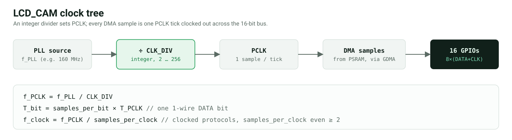
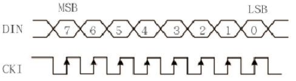
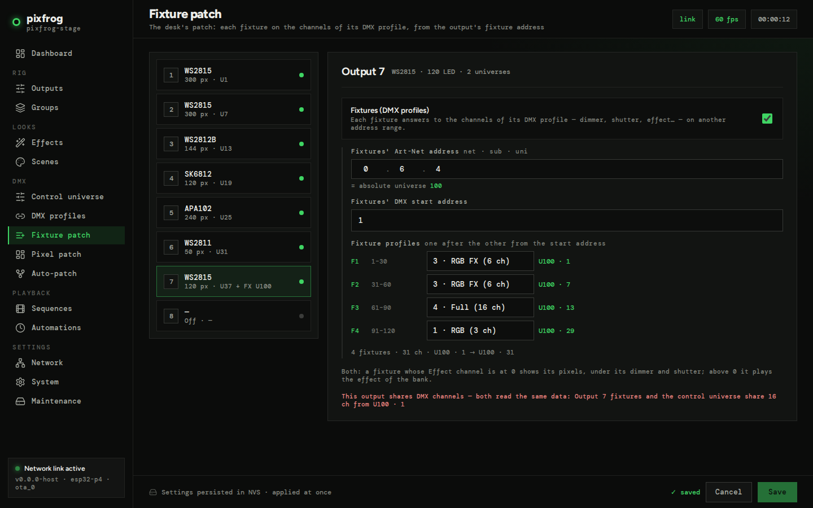

# LED protocols — pixfrog

Reference for timings, clock formulas and DMA encoding for every protocol pixfrog supports.

> Any deviation from the values in this document must be justified and verified on a scope.

---

## 1. Supported protocols

| Protocol | Family    | Bit-rate / max CLOCK | Default order | Bits/pixel | Notes                       |
|----------|-----------|----------------------|---------------|-----------:|-----------------------------|
| WS2815   | 1-wire NRZ | 800 kbps             | GRB           | 24         | Primary target, robust signal |
| WS2812B  | 1-wire NRZ | 800 kbps             | GRB           | 24         | Near-identical to WS2815    |
| WS2811   | 1-wire NRZ | 400 or 800 kbps      | RGB           | 24         | Slow or fast variant        |
| SK6812   | 1-wire NRZ | 800 kbps             | GRB or GRBW   | 24 or 32   | Common RGBW variant         |
| WS2814   | 1-wire NRZ | 800 kbps             | RGBW          | 32         | Dedicated white channel     |
| APA102   | SPI-like   | 1–30 MHz CLOCK       | BGR           | 32 (start + brightness + BGR) | 5-bit hardware brightness |
| SK9822   | SPI-like   | 1–30 MHz CLOCK       | BGR           | 32         | APA102-compatible timing    |
| LPD8806  | SPI-like   | 1–20 MHz CLOCK       | GRB           | 24         | MSB of every byte must be 1 |

---

## 2. 1-wire NRZ timings

Typical values in nanoseconds. T0H = high time encoding a `0`, T1H = high time encoding a `1`, etc. TRESET = low time required between frames for the strip to latch.


| Protocol      | T0H  | T0L  | T1H  | T1L  | TDATA (T0H+T0L = T1H+T1L) | TRESET   |
|---------------|-----:|-----:|-----:|-----:|---------------------------:|---------:|
| WS2815        | 300  | 950  | 950  | 300  | 1 250                      | ≥ 280 µs |
| WS2812B       | 350  | 800  | 700  | 600  | 1 250                      | ≥ 50 µs  |
| WS2811-fast   | 350  | 800  | 700  | 600  | 1 250                      | ≥ 50 µs  |
| WS2811-slow   | 700  | 1 600 | 1 200 | 1 300 | ~2 500                  | ≥ 50 µs  |
| SK6812        | 300  | 900  | 600  | 600  | 1 200                      | ≥ 80 µs  |
| WS2814        | 300  | 950  | 950  | 300  | 1 250                      | ≥ 280 µs |

Datasheet tolerance is typically ±150 ns per sub-time. pixfrog aims for the middle of the tolerance window for cross-batch compatibility.

---

## 3. Bus clock formula

### 3.1 Clock tree



Both output backends clock the 16-bit bus at the same system-wide sample rate
`f_PCLK = 16 MHz` (`led_protocols::kPclkHz`), reached from a PLL source by an
integer divider:

- **PARLIO TX** (default): `PARLIO_CLK_SRC_DEFAULT` = PLL_F160M, divided by 10 → **160 MHz / 10 = 16 MHz exact**.
- **LCD_CAM** (legacy): `LCD_CLK_SRC_DEFAULT` divided so the requested `pclk_hz = 16 MHz` is realised.

Formulas:

```
f_PCLK   = f_PLL_source / CLK_DIV         integer divider
T_PCLK   = 1 / f_PCLK                     period of one DMA sample
T_bit    = samples_per_bit × T_PCLK       duration of one 1-wire DATA bit
```

For clocked protocols:

```
T_clock_cycle = samples_per_clock × T_PCLK
f_clock_out   = 1 / T_clock_cycle = f_PCLK / samples_per_clock
```

where `samples_per_clock` is even and ≥ 2 (half low, half high).

### 3.2 PCLK choice for pixfrog

Criterion 1: cover WS2815 timing (T0H = 300 ns, T1H = 950 ns) with tight granularity.
Criterion 2: support useful APA102 CLOCK rates (≥ 1 MHz, ideally 6+ MHz).
Criterion 3: keep the DMA bus load below 30 % of PSRAM bandwidth.

**Chosen value**: `f_PCLK = 16 MHz`, so `T_PCLK = 62.5 ns`.

1-wire verification:

| Target (ns) | Ideal samples | Chosen samples | Realised (ns) | Error    |
|-------------|--------------:|---------------:|--------------:|---------:|
| T0H = 300   | 4.8           | 5              | 312.5         | +12.5 ns |
| T0L = 950   | 15.2          | 15             | 937.5         | −12.5 ns |
| T1H = 950   | 15.2          | 15             | 937.5         | −12.5 ns |
| T1L = 300   | 4.8           | 5              | 312.5         | +12.5 ns |
| TDATA       | 20            | 20 (= T0H+T0L) | 1 250         | 0        |

→ `samples_per_bit = 20` for WS2815, total bit = 1 250 ns. ✓

Clocked verification:

```
samples_per_clock = 2   → f_clock = 8 MHz   (APA102 at 8 MHz, OK)
samples_per_clock = 4   → f_clock = 4 MHz
samples_per_clock = 8   → f_clock = 2 MHz
samples_per_clock = 16  → f_clock = 1 MHz
```

Reachable CLOCK range: **125 kHz to 8 MHz** in integer divisor steps. Plenty for real-world use (APA102 is reliable at 4–8 MHz on ~100 LED strings).

### 3.3 Other 1-wire protocols at PCLK = 16 MHz

| Protocol     | T0H target | T1H target | Samples T0H | Samples T1H | Samples / bit | Max error |
|--------------|----------:|-----------:|------------:|------------:|--------------:|----------:|
| WS2815       | 300       | 950        | 5           | 15          | 20            | ±13 ns    |
| WS2812B      | 350       | 700        | 6           | 11          | 20            | ±25 ns    |
| WS2811-fast  | 350       | 700        | 6           | 11          | 20            | ±25 ns    |
| WS2811-slow  | 700       | 1 200      | 11          | 19          | 40            | ±25 ns    |
| SK6812       | 300       | 600        | 5           | 10          | 19 (~1 187 ns) | ±13 ns   |
| WS2814       | 300       | 950        | 5           | 15          | 20            | ±13 ns    |

All errors are under the ±150 ns datasheet tolerance. ✓

---

## 4. DMA encoding (1-wire vs clocked)

The DMA buffer is a stream of 16-bit samples. In each sample, each bit is the state of one GPIO at that PCLK tick.

```
sample[t] = (CH8_CLOCK << 15) | (CH8_DATA << 14) | … | (CH1_CLOCK << 1) | CH1_DATA
```

### 4.1 1-wire NRZ encoding (WS2815, samples_per_bit = 20)

To encode a `1` on CH1_DATA:

```
sample[0]   : CH1_DATA = 1
sample[1]   : CH1_DATA = 1
…
sample[14]  : CH1_DATA = 1   // 15 HIGH samples = 937.5 ns ≈ T1H
sample[15]  : CH1_DATA = 0
…
sample[19]  : CH1_DATA = 0   // 5 LOW samples = 312.5 ns ≈ T1L
```

To encode a `0`:

```
sample[0]   : CH1_DATA = 1
…
sample[4]   : CH1_DATA = 1   // 5 HIGH samples = 312.5 ns ≈ T0H
sample[5]   : CH1_DATA = 0
…
sample[19]  : CH1_DATA = 0   // 15 LOW samples = 937.5 ns ≈ T0L
```

CH1_CLOCK stays 0 for all 20 samples (the CLOCK pin exists on the bus but is never connected to a 1-wire strip).

### 4.2 Clocked SPI-like encoding (APA102, samples_per_clock = 4 → 4 MHz)



To transmit 1 DATA bit clocked on 1 CLOCK cycle:

```
sample[0]   : CH1_CLOCK = 0, CH1_DATA = bit  // setup
sample[1]   : CH1_CLOCK = 0, CH1_DATA = bit  // setup
sample[2]   : CH1_CLOCK = 1, CH1_DATA = bit  // rising edge — strip latches
sample[3]   : CH1_CLOCK = 1, CH1_DATA = bit  // hold
```

APA102 byte sequence:

```
Start frame : 0x00 0x00 0x00 0x00                   (4 bytes, 32 bits → 32 CLOCK cycles)
Pixel       : 0xE0|brightness  +  B  +  G  +  R     (4 bytes per pixel)
End frame   : 0xFF × ceil(N/2)/8                    (propagation padding, see datasheet)
```

### 4.3 Latch / reset

For 1-wire protocols, after the last pixel, DATA must stay LOW for TRESET (≥ 280 µs for WS2815). At 16 MHz that's 4 480 zero samples. They sit at the tail of the frame buffer:

- **PARLIO TX** (default): the frame loops back-to-back, so the reset tail is what separates one repeat from the next — the strips re-latch every loop. The bus is never "parked"; it re-emits the same frame until a new buffer is mounted.
- **LCD_CAM** (legacy): once GDMA finishes the single emission, the bus stays parked on those trailing zeros until the next `esp_lcd_panel_draw_bitmap`.

For clocked protocols there's no latch — the bus simply repeats (PARLIO) or goes idle (LCD_CAM) after the end frame.

### 4.4 Single PSRAM frame buffer, no chunks

The encoder produces **one complete PSRAM frame buffer** per frame, not a chain of small chunks. The render task writes into a drained back buffer, flushes the cache (`esp_cache_msync`, DIR_C2M), hands it to the DMA engine, and GDMA streams the PSRAM directly without any CPU involvement. How many buffers and how the swap is armed differ per backend:

- **PARLIO TX** (default): **three** flat buffers, one mounted in loop transmission mode. `parlio_tx_unit_transmit` while looping concatenates the next buffer onto the tail of the running DMA link list, so it takes over at the next frame boundary, gapless. Loop mode marks no DMA EOF, so a retired buffer is known free only one frame duration after its swap was submitted. With only two buffers the one to reuse is exactly the one freed one frame ago (no slack) — a third buffer gives a full frame of drain so the encode of frame N+2 overlaps the wire emission of N and N+1 instead of serialising after it (`led_output/src/parlio_output.cpp`, `kNumFb = 3`).
- **LCD_CAM** (legacy): `esp_lcd_new_rgb_panel(flags.fb_in_psram = true, num_fbs = 2)`; `esp_lcd_panel_draw_bitmap` swaps the active FB pointer and a `vsync` callback releases the previous one.

Consequence for the encoder: **no sub-frame real-time deadline**. It has the full DMA emission window of the current frame (up to ~30 ms at 30 Hz with 1024 px WS2815) to produce the next one.

---

## 5. Mixed multi-channel strategy

All channels share the same PCLK = 16 MHz. Consequences:

- The 8 channels are emitted **in parallel** on the 16 bus bits; total DMA duration is dictated by the longest channel, not the sum.
- 1-wire duration  = `pixels × bits_per_pixel × samples_per_bit / f_PCLK + T_reset`
- Clocked duration = `(start_bytes + pixels × bytes_per_pixel + end_bytes) × 8 × samples_per_clock / f_PCLK`
- Shorter channels emit zero samples after their last useful bit (no effect on strips that have already latched).

### 5.1 Practical limits per protocol

Each protocol's bit-rate sets a physical floor that no software optimization can bypass. The refresh rate is any integer from 20 to 120 Hz (`config::kMinRefreshHz..kMaxRefreshHz`). The numbers below are the caps the firmware **computes and enforces** (`dmx::logic::max_pixels_for`): the largest `pixel_count` whose encoded frame fits both the emission budget (period − 1 ms encode-overlap reserve) and the DMA frame buffer, capped at 1024 px (512 slots for DMX, one universe).

| Protocol             | Bit rate | Bits/px | 20 Hz | 30 Hz | 40 Hz | 50 Hz | 60 Hz | 120 Hz |
|----------------------|---------:|--------:|------:|------:|------:|------:|------:|-------:|
| WS2815 (RGB)         | 800 kbps | 24      | 1024  | 1024  | 790   | 624   | **512** | 235  |
| WS2812B / WS2811     | 800 kbps | 24      | 1024  | 1024  | 798   | 631   | **520** | 242  |
| WS2814 (RGBW)        | 800 kbps | 32      | 1024  | 801   | 593   | 468   | **384** | 176  |
| SK6812 (RGBW)        | 800 kbps | 32      | 1024  | 848   | 629   | 497   | **410** | 190  |
| APA102 / SK9822 @ 4 MHz CLOCK | 4 Mbps | 32 | 1024* | 1024* | 1024* | 1024* | 1024* | 901 |
| LPD8806 @ 4 MHz CLOCK | 4 Mbps  | 24      | 1024* | 1024* | 1024* | 1024* | 1024* | 1024* |

Above 60 Hz the wire is the limit, not the CPU: measured on the board, the
encoder spends ≈ 23 µs per pixel row for 8 WS2815 outputs, so 8 × 235 px
encodes in ≈ 5.5 ms of the 8.3 ms 120 Hz period (encode overlaps emission).

\* Clocked at 4 MHz the bus clears the frame well inside the budget, so the 1024-px hard cap is reached first. WS2815 (RGB, 280 µs reset) caps lower than WS2812B/WS2811 (50 µs reset) despite the same bit rate.

Formula (LED): `max_pixels = floor( (period_µs − 1000 − T_reset_µs) / (bits_per_pixel × samples_per_bit / f_PCLK) )`, then clamped to the buffer and the 1024/512 ceiling. e.g. WS2815 @ 60 Hz: `(16666 − 1000 − 280) / 30 µs = 512`.

### 5.2 Worked example

8 channels × 600 px WS2815, in parallel = **600 × 24 × 20 / 16e6 = 18 ms of pure DMA**, plus 280 µs TRESET → **~18.3 ms per frame**.

- At 60 Hz (budget 16.67 ms): **does not fit**. The per-channel cap truncates each WS2815 channel to 512 px.
- At 30 Hz (budget 33.33 ms): comfortable, ~15 ms of slack left for encoding the next frame in parallel.

### 5.3 The emitted count is bounded, the stored count is not

The bus never clocks out more than fits in time, but the configured
`pixel_count` is left as set:

- `dmx::effective_channel(ch)` is the channel as emitted — its config with
  `pixel_count` limited to `dmx::channel_max_pixels(ch)` (the table above).
  Decode, scenes/failsafe, the encoder descriptor and the render pacing all go
  through it, so raising the refresh rate (or switching to a slower protocol
  or clock) drives fewer pixels, and lowering it again brings the full line
  back. Nothing is rewritten in NVS.
- `dmx::validate_capacity` flags a channel whose stored count is above its
  budget (`is_channel_capacity_ok(ch) = false`): `!` and a red count on HOME,
  `stored→emitted px` plus a warning in the web channel editor, a log line.
- The TFT pixel-count editor stays bounded to `channel_max_pixels(ch)` (the
  live ruler maps 1:1 to LEDs); the web UI and the console accept up to 1024
  (512 DMX slots) at any rate.

### 5.4 Dead pixels (gaps)

Up to 8 runs of dead physical LEDs per channel (`ChannelConfig::gaps`,
`led::PixelGap {pos, len}`): a sacrificial level-shift pixel at the head of a
line, a repeater or injector carrying an LED chip mid-line. They are wiring,
so they are indexed in physical order from the controller and never move with
`invert` or `grouping`.

- `pixel_count` counts **live** pixels: DMX data (and scenes, failsafe,
  identify) fill the live pixels only, so universe usage is unchanged.
- The encoder emits black on dead positions and shifts the live pixels past
  them (`detail::source_pixel`: gap lookup, then invert/grouping on the live
  index). Both the per-channel and the single-pass encoders go through it.
- The budget counts **physical** pixels: `max_pixels_for` is physical, and the
  live maximum the UIs show is `live_within(max_physical)` — at 60 Hz a WS2815
  line with 3 dead pixels carries 509 live ones.
- Gaps are normalized on every write (sorted, overlapping/adjacent runs
  merged, unused slots last). A gap starting past the end of the line is kept
  but costs nothing.
- The pixel-count ruler paints dead pixels dim red in place; while a gap is
  being edited on the TFT the ruler follows the pending value.
- Edit: web channel editor ("Dead pixels"), console
  `ch N gaps 1:1,301:2` (first dead LED, 1-based : count; `-` clears), TFT
  channel menu → "Dead px". API/backup: `"gaps": [[first_led, count], ...]`.

### 5.5 Fixtures

Up to 32 fixtures per channel (`ChannelConfig::fixtures`, `config::Fixture
{pos, len}`): runs of physical LEDs a scene treats as one luminaire (a bar, a
tube). Physical positions like the gaps, so the two describe one layout; the
web editor shows them as one list over a bar that draws the strip, the
fixtures, the dead LEDs and any overlap.

- A fixture can be marked mounted the other way round (`kFixtureReversed`,
  a flag bit in `Fixture::len`; `[first, count, 1]` in the API, ⇄ in the
  editor): the scenes run through it backwards. Its DMX pixel data is left
  as wired.
- Fixtures never share an LED: the API refuses an overlapping list (400,
  "fixtures N and M overlap"), the web editor flags it and will not save.
  A dead LED inside a fixture is allowed, it only shortens the fixture.
- They change scenes (and the failsafe scene); the DMX data follows them only
  with the per-fixture layout (§5.6).
- A scene part's `fixture_mode` (`"fixture_mode"` in the API) picks how its
  effect spreads: `each` (every fixture plays it on its own — the default, so
  defining fixtures is enough), `strip` (the whole strip, fixtures ignored), `chain` (the fixtures end to end as one strip, without the
  LEDs between them), `mirror` (chained over the first half, mirrored on the
  second). Live pixels in no fixture stay dark outside `strip`.
- Rendering: `logic::fixture_spans` maps each fixture to its run of the source
  buffer (dead LEDs skipped, then invert and grouping, as the encoder does);
  `logic::fill_effect_on_channel` draws the effect per span.
- Edit: web channel editor ("Fixtures & dead LEDs"): the strip as an ordered
  list of sizes — fixture, dead LEDs, LEDs without fixture — positions follow
  from the order (drag to reorder), the pixel count from the list; a "N × L +
  K dead" fill. API/backup: `"fixtures": [[first_led, count], ...]`.

### 5.5b Fixture groups

Up to 16 named groups (`config::GroupsConfig`, own NVS blob `groups`), each an
ordered list of up to 64 fixtures taken on any outputs (`FixtureRef {output,
fixture}`, the fixture by its index in the output's strip order). A group is
where a scene plays, and its order is the strip the effect runs along —
"Top" listed from the left edge to the right one, whatever the wiring.

- API: `"groups": [{"name", "members": [[output, fixture], ...]}]` in
  `/api/config` and the backup; `POST /api/groups {"groups": [...]}`
  replaces the list (all or nothing; repeated or out-of-range members are
  refused or dropped).
- Web: the Groups screen — pick fixtures per output (or all of one), drag to
  reorder, reverse the order.
- Editing an output's fixture list can shift what a member points at (it is
  an index); the editor flags members that no longer exist.

Scenes on groups (`dmx::group_play / group_stop`, the render task draws them):
- A scene playing on a group is drawn **once a frame** along the group's
  virtual strip (members end to end, in order — `logic::render_group_strip`):
  `each` member on its own, `strip`/`chain` one effect across, `mirror` over the
  first half mirrored on the rest; the part's **reverse** bit runs it from the
  far end (in mirror: from the centre out). Each member's slice then goes into
  its fixture (`put_member`: flipped for a reversed bar or an inverted output;
  RGB, W off on RGBW).
- Ownership is per fixture: a play takes its group's fixtures over from any
  other play, the rest keep theirs; a fixture nobody owns shows its output's
  own source (live, FSEQ, an output scene). Starting a scene on outputs, or
  stopping them, takes their fixtures back. Fixtures crossfade from a snapshot
  of what they showed (`scene_fade_ms` / the desk's Fade).
- On a group a scene plays its **first part**: that effect of the bank, with
  the part's fixture mode and direction (`config::copy_scene_look`); the
  part's outputs do not matter there, and a scene may keep a part without any
  output for that purpose alone.
- Up to 16 plays; strips up to 4096 pixels (PSRAM). A scene's default group is
  `Scene::group`; a part's reverse bit shares `ScenePart::fixture_mode` with
  the mode. A scene with a default group plays there when started whole (web
  ▶, boot, menu). API: `POST /api/scene/n/play {"group": g}`, `"group"` on a
  scene and `"reverse"` on its parts, `show.plays` = `[[scene, group], …]` in
  the status; console `scene play <n> group <g>`, `scene group <n> <g|none>`,
  `scene part … [rev]`.

### 5.6 DMX layout and auto-patch

How a channel's pixels fill its universes is per channel
(`ChannelConfig::packing`, `"packing"` in the API, `ch N packing` on the
console), from `(universe_start, dmx_start)`:

| packing | layout | 1024 px RGB |
|---|---|---|
| `continuous` (default) | byte after byte; a pixel may straddle two universes | 6 universes |
| `whole` | whole pixels only: 170 RGB / 128 RGBW per universe (xLights / Falcon / FPP "510 channels") | 7 universes |
| `fixture` | each fixture (§5.5) from slot 1 of a universe of its own, whole pixels inside; pixels in no fixture get no data; no fixtures = `whole` | 1 + per fixture |
| `colour` | one colour per fixture: 3 channels a bar (4 RGBW), bars in strip order, the bar lit with it — patch each bar as a plain RGB fixture; no fixtures = one colour for all | a few slots |
| `control` | **DMX control mode**: no pixel data. Each fixture takes the channels of its DMX profile, one after the other | 3 channels with one RGB fixture |

**DMX control mode** turns pixel mapping off for an output and drives its
fixtures like conventional luminaires (the profiles, their functions and
presets: SHOW_CONTROL "Fixture DMX profiles"):

- The fixtures follow each other on the wire from `(universe_start,
  dmx_start)`, in the order they are listed, each taking the footprint of its
  profile. A fixture never straddles two universes: one that would starts the
  next at slot 1.
- An output without fixtures is one fixture covering the strip, on the first
  profile. LEDs in no fixture stay dark. A fixture whose profile left the bank
  uses the first.
- Each frame, every fixture reads its channels and plays what they ask for:
  its colour, steady (effect channel at 0), or an effect of the bank with the
  desk's colours, speed, phaser and Block / Groups / Wings — at its dimmer,
  through its shutter. All fixtures share the box's clock.
- Everything above the network path is unchanged: a scene started on the
  output overrides the desk, the failsafe takes over on signal loss, the
  grand master, blackout and strobe apply after.
- The patch sheet — universe, address and channel count per fixture — is
  `"patch"` on the channel in `GET /api/config`, `patch=` in `ch N` on the
  console, and shown next to each fixture in the web channel editor.



The point is the universe count: eight outputs of 300 RGBW pixels take 24
universes pixel-mapped, and one in control mode with a 16-channel fixture
each.

`logic::channel_layout` turns a channel into runs (universe offset, slot,
buffer offset, bytes); decoding, the universe span (`channel_universe_span`,
which now counts `dmx_start` — a channel starting late used to lose its last
universe), the pool map and the sACN joins all follow it.

Auto-patch (`POST /api/autopatch {base, compact, packing}`, console
`autopatch <base> [compact] [continuous|whole|fixture]`, web Auto-patch
screen; the TFT/OLED menu keeps the aligned default):
- **aligned** (default): every output opens a universe at slot 1.
- **compact**: an output starts at the slot after the previous one, sharing
  its universe (a `whole` output skips to the next universe when not one pixel
  fits; a `fixture` output always opens one). A shared universe takes one pool
  slot feeding both outputs (`g_slot_chans` is a bit per channel), so activity
  and failsafe follow every output on it.
- `packing` other than `keep` is set on every output first — a pixel layout:
  an output in DMX control mode keeps its mode. Such outputs chain like the
  others; compact, one starts in the next universe when its first fixture
  would not fit in what is left.
- An enabled DMX control universe follows the outputs: in the room left in the
  last universe when compact, else from slot 1 of the next.

The reply carries `universes` against `pool` (72, §DMX pool): a patch needing
more is flagged in the web UI and the console (`warn=pool_full`).

---

## 6. Verification

Unit tests (`components/led_protocols/test/`):

1. For each 1-wire protocol: encode one pixel `(0xFF, 0x80, 0x00)`, verify the produced samples match the target timings within ±0 sample.
2. APA102: encode one pixel `(R=0xFF, G=0x80, B=0x00, brightness=31)`, verify start+frame+end structure and `samples_per_clock`.
3. Bounds: pixel_count = 1 and pixel_count = 1024 — verify the DMA size never exceeds the configured ceiling.
4. Throughput: encoding 1024 px WS2815 (worst case) must complete in ≤ 20 ms on a reference CI runner.

Integration tests (hardware required):

1. Emit a calibration pattern (1 kHz square wave) on each of the 16 GPIOs, observe on scope (`output::emit_calibration_pattern(0)`).
2. Verify CLOCK is strictly synchronous with DATA on the same channel (delta < 5 ns).
3. Verify there are no glitches on back-to-back transitions.

---

## 7. DMX512 output — removed

DMX512 output was removed from this firmware; it lives in the DMX node firmware (a separate project forked from this one). Channels
stored with the retired protocol value (9) load as Off; a backup naming
`DMX512` restores that channel as Off.

## 8. Network inputs (ArtNet / sACN)

Both receivers feed the same universe pool; a channel maps `universe_start …
universe_start + N-1` whichever protocol delivered the data.

**ArtNet 4** (UDP 6454, always on): `ArtDmx` (filtered by configured
net/subnet), `ArtPoll` → `ArtPollReply` (2 bind groups × 4 ports),
`ArtSync` (sync mode, below), `ArtAddress` (remote names/net/subnet/SwOut,
persisted + replied), `ArtIpProg`/`ArtIpProgReply` (remote IP, reboot
applies), `ArtTrigger` global KeyShow (SubKey 1..8 plays standalone scene
N-1, 0 stops), `ArtTimeCode` (slaves a *running* FSEQ playback to the desk
clock — re-seeks beyond 100 ms drift, never auto-starts a file).
`ArtNzs`/`ArtCommand` are validated and counted (`stats artnet_ctrl_rx`)
but not consumed yet.

**sACN / E1.31** (UDP 5568, opt-in `sacn_enabled`): data packets matched on
the flat universe number (no net/subnet concept), one IGMP join per
configured universe (set refreshed every 5 s from live config; unicast always
accepted). Per-source gate, keyed by universe + CID: a packet passes when
its priority is at least that of every other live source on the universe (a
source may lower its own), one 0..19 behind its source's last sequence
number is a duplicate or late and is dropped (§6.7.2), 2.5 s source timeout
(§6.7.1), `stream_terminated` releases the slot **and** expires the
owning channel's failsafe immediately, preview-flagged data ignored. Data
carrying a synchronization address waits for an E1.31 sync packet on that
address (sync mode, below); `Force_Synchronization` keeps it waiting when
syncs stop. Equal-priority
sources go through the shared 2-source HTP/LTP merge (keyed by CID hash,
same engine as concurrent ArtDmx senders).

**Sync mode** (Art-Net 4 `ArtSync`, E1.31 synchronization): until a sync is
seen, universes are published as they arrive (free-run). Once a controller
syncs, received universes pile up in the back bank and go out together on
the next sync, so an output spanning several universes never shows two
source frames; a sync with nothing new is used up. Without syncs for 4 s
(Art-Net) or 2.5 s (E1.31) the box free-runs again. A sync also wakes the
render wait, so the frame leaves within the refresh period.

**FPP MultiSync** (UDP 32320 + multicast 239.70.80.80, opt-in `fpp_remote`):
the box follows an FPP/xSchedule master — START plays the named local
`.fseq`, STOP stops, periodic SYNC corrects drift > 100 ms and hot-joins a
show already running on the master. Media sync packets are ignored.
