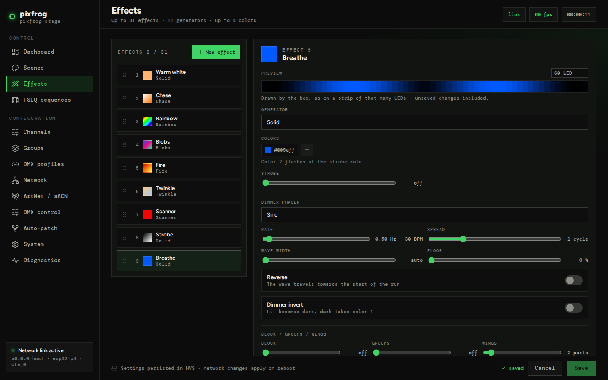
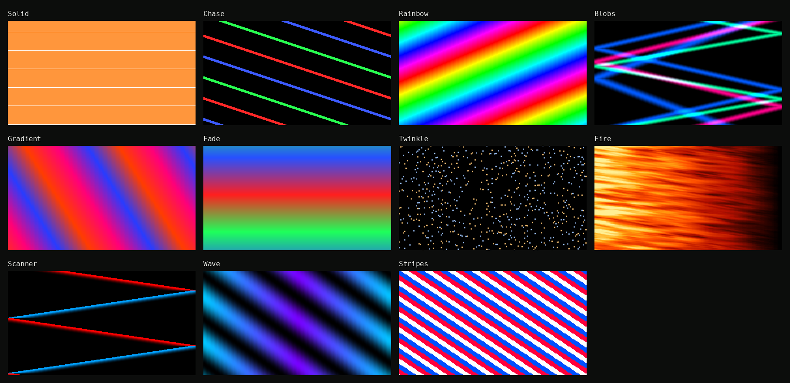
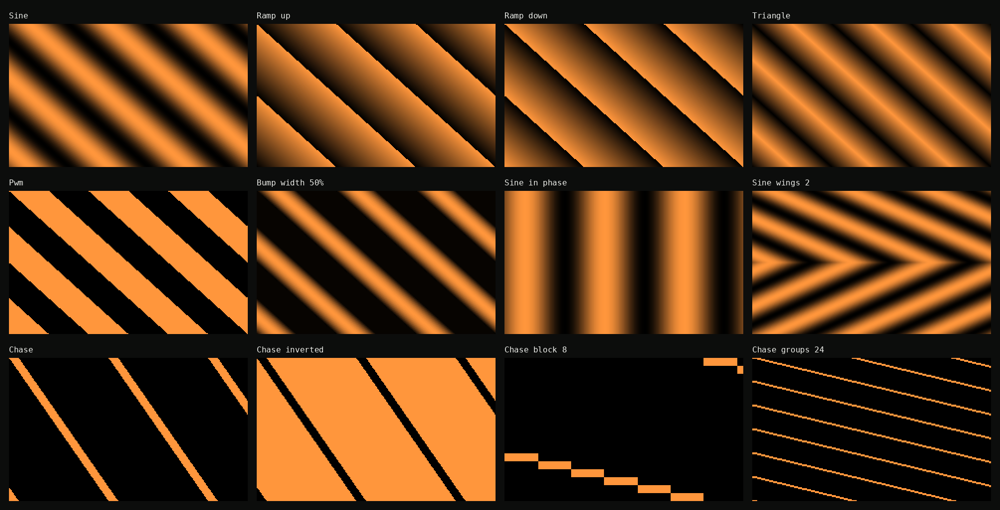
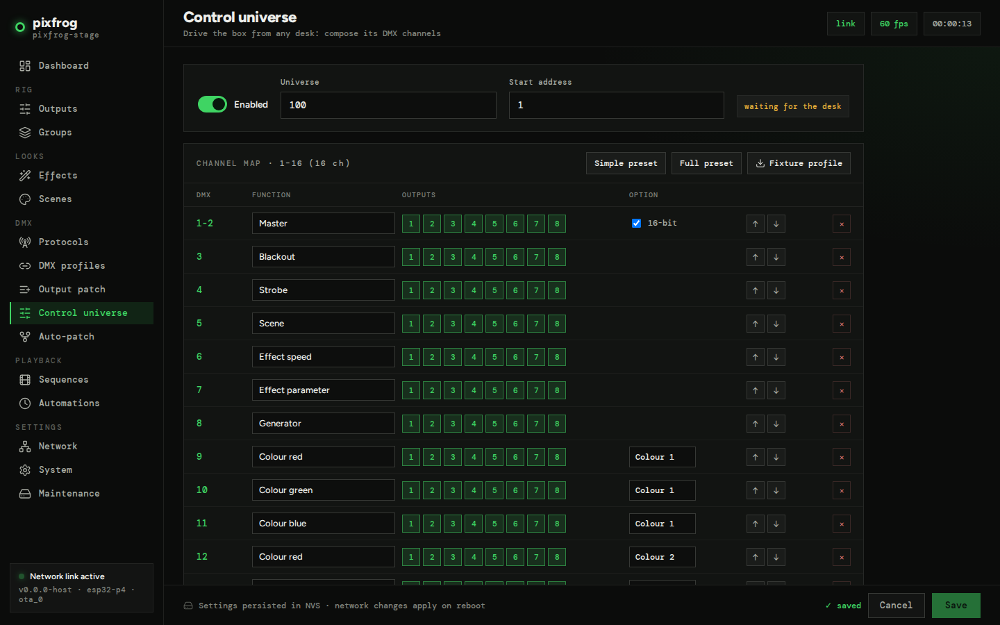
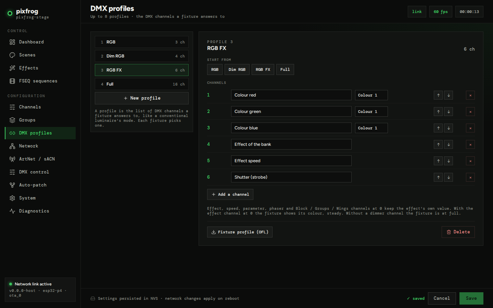

# Show control

Grand master, blackout and strobe, scene zones and crossfades, and the DMX
control universe that drives them from any lighting desk.

## Grand master, blackout, strobe

Three runtime controls sit after everything an output renders (network, scene,
FSEQ, failsafe). Each can target all outputs or a group:

| Control | Effect |
|---|---|
| Master | scales the output, 0–100 % (16-bit from the desk) |
| Blackout | output dark |
| Strobe | short flashes (≤ 30 ms) at 1–25 Hz |

They reset at reboot (full, lit, steady). Local values (web, TFT, UART,
ArtTrigger) and the desk's combine: the masters multiply, the blackouts add up,
and the faster strobe wins. Identify and the pixel-count ruler ignore all three,
so a strip can still be found during a blackout.

| From | How |
|---|---|
| Web UI | the SHOW card on the dashboard |
| TFT | SHOW → Master / Blackout / Strobe / Fade |
| UART | `show master <0..100> [outputs]`, `show blackout on\|off\|toggle [outputs]`, `show strobe <0..25> [outputs]`, `show fade <ms>` |
| REST | `POST /api/show {"outputs":15,"master":80,"blackout":true\|false\|"toggle","strobe_hz":5}` |
| ArtTrigger | Oem 0xFFFF, Key 1 (KeyMacro): SubKey 1 = toggle, 2 = on, 3 = off |

`outputs` is a bitmask: bit 0 = output 1, so `0f` = outputs 1–4.

## Effects and scenes

An **effect** is a look, kept in a bank of up to 31: a generator, one to four
colours, a speed and a parameter. It has no target. A **scene** is a memory of
up to eight **parts**, each sending one effect of the bank to a set of outputs
("effect 5 on outputs 1–4, effect 1 on outputs 5–8") with a fixture mode
(PROTOCOLS §5.5). An output belongs to one part at most; a scene leaves the
outputs of no part alone. Editing an effect changes every scene that plays it.

A scene can also play on a **fixture group** (PROTOCOLS §5.5b) — bars picked on
any outputs, in the group's order — instead of whole outputs: there it plays
its first part's effect along the group, in that part's fixture mode, from the
far end if the part says so. Give the scene a default group ("Plays on") and
▶, the boot scene and the menu start it there.

The editor's **preview** strip is drawn by the box itself, with the renderer
of the outputs, on 30, 60 or 144 LEDs: what it shows is what a strip of that
length plays, unsaved changes included (`POST /api/effect/preview`). It needs
no output and no scene, so a look can be built without touching the rig.

The eleven generators, each over six seconds on a 144-pixel line (time going
right, pixel 0 at the top), rendered by the firmware's own `fill_effect_run`
(`tools/effects_gallery/gallery.py`):

Speed runs 0–255, in steps of two generator units: 2 px/s per step for chase,
scanner and stripes (up to 510 px/s), 20 °/s for rainbow. Solid is apart: its
speed is a strobe frequency, 0–60 Hz, where 255 means "steady colour 2".

### Dimmer phaser and invert

An effect can carry a **dimmer phaser**: a waveform that dims what the
generator draws, travelling along the pixels of the run (a fixture, or the
chained fixtures, as the part's fixture mode says).

| Setting | Meaning |
|---|---|
| Wave | none, sine, cosine, ramp up, ramp down, triangle, PWM, bump (a half-sine hump) |
| Rate | 0–255, 0.05 Hz (3 BPM) a step — 0 is a still wave, 255 is 12.75 Hz |
| Spread | phase shift along the run, 1/16 cycle a step: 0 = every pixel in phase (the run breathes as one), 16 = one whole wave along the run |
| Width | the share of the cycle the wave takes (n/255, 0 = all of it): it runs compressed, then holds its end level. For PWM, the lit share (0 = half) |
| Floor | the dimmer's low point (n/255): the wave runs between the floor and full |
| Attack, Decay | PWM only: the shares of the lit part spent fading in and out (n/255 each, 0 = a hard edge). A square becomes a trapezoid; when the two take the whole lit part, a triangle |
| Reverse | the wave travels towards the start of the run |

**Dimmer invert** is the intensity negative of the whole effect, with or
without a phaser: a pixel as bright as colour 1 goes dark, a dark pixel takes
colour 1, the hue is kept in between. A chase becomes a lit strip with a dark
gap running through it; a sine phaser shifts by half a cycle; a steady colour
alone goes dark.

In grandMA2 terms this is an effect line on the dimmer: Wave is the **Form**,
Spread the **Phase** range over the selection (16 = "0 thru 360"), Width the
**Width**, Attack and Decay the same, Reverse the **Dir**. A light wave
running along a strip — `900012345678900012345678` — is a ramp down, three
cycles of spread, 75 % of width, and a rate.

UART: `fx phaser <n> <wave> [<rate> <spread> [<width> <low> [reverse|forward]]]`,
`fx envelope <n> <attack> <decay>`, `fx invert <n> 0|1`. REST: `"phaser":
{"wave", "rate", "spread", "width", "low", "attack", "decay", "reverse"}` and
`"invert"` in the effect.

### Block, Groups, Wings

A desk's MAtricks, applied to the **pixels** of the run an effect is drawn on
(a fixture, the chained fixtures or the whole strip, as the part's fixture mode
says). The generator and the phaser are drawn on a shorter virtual run, which
is then spread over the pixels:

| Setting | Effect on a 24-pixel run |
|---|---|
| Block *N* | *N* neighbouring pixels share one value — block 3: 8 values, each 3 pixels wide |
| Groups *N* | the pattern repeats every *N* values — groups 6: the same 6 pixels four times |
| Wings *N* | the run splits in *N* parts, every other one mirrored — wings 2: the effect runs in from both ends |

0 or 1 turns a setting off; the three combine (wings first, then blocks, then
the repeat). The generator's widths and its pixel-per-second speeds count on
the virtual run: with block 8, a chase head of width 1 is 8 pixels wide and
moves 8 pixels a step.

The layers over a generator — the phaser's waveforms, the invert, Block /
Groups / Wings — as the same space-time strips:

 UART: `fx matricks <n> <block> <groups> <wings>`. REST:
`"matricks": {"block", "groups", "wings"}` in the effect.

| Edit | Effects | Scenes |
|---|---|---|
| Web UI | **Effects** screen | **Scenes** screen: the parts — their outputs, effect, fixture mode and direction — and the group the scene plays on |
| UART | `fx`, `fx add [name]`, `fx set <n> <generator> <rrggbb[,…]> <speed> <param>`, `fx name`, `fx move`, `fx del` (refused while a scene plays it) | `scene`, `scene add [name]`, `scene part <n> <outputs-hex> <effect> [each\|strip\|chain\|mirror] [rev]`, `scene group <n> <group\|none>`, `scene clear <n>`, `scene name`, `scene move`, `scene del` |
| REST | `POST /api/effect/<n>`, `/api/effects/add\|move` | `POST /api/scene/<n>`, `/api/scenes/add\|move` |
| TFT / OLED | — (the bank is edited from the web or the console) | LOOKS → **Scenes**: name, the group it plays on, its parts — outputs (one toggle each; an output taken by a part leaves the other), effect of the bank, fixture mode, direction — `[Add part]`, `[New]`, `[Delete]`, and `[Play]` / `[Stop]` to see the result |

Scenes stored by an older firmware are converted at the first boot: each
becomes one effect and one single-part scene, at the same position and the
same pace. A backup taken before the effect bank restores the same way.

## Scene zones and crossfades

Each output plays its own scene or the live input. Starting a scene claims the
outputs of its parts (limited to a requested group, if one is given) and
leaves the others alone. Two scenes on outputs 1–4 and 5–8 therefore run side by
side, and a scene started on an overlapping group takes those outputs over.
`scene stop <n>` stops one scene; `scene stop` stops them all.

| From | Play scene *n* on a group |
|---|---|
| Web UI | scene editor → ▶ Play: the scene on the outputs of its parts; ■ Stop stops that scene only. The ▶ of the scene list does the same. |
| UART | `scene play <n> <outputs-hex>` (e.g. `scene play 0 01`, `scene play 1 02`), `scene stop <n>` |
| REST | `POST /api/scene/<n>/play {"outputs":1}`, `POST /api/scene/<n>/stop` |
| Desk | two Scene slots with different output groups in the control universe |
| TFT, ArtTrigger | play on the outputs of the scene's parts (SHOW → Scenes: one click a scene) |

Every change of source crossfades over the scene fade time (`scene_fade_ms`,
0–25.5 s, eased). This covers live → scene, scene → scene and scene → live.
The fade is global, and the desk's Fade channel overrides it.

## DMX control universe

A fixture mode you compose yourself. It starts at an address in a universe
(Art-Net port-address, or the same sACN universe), and each slot below takes
one DMX channel (two for a 16-bit master) in list order. Every slot acts on
a set of outputs, or on a **fixture group** (docs/PROTOCOLS.md §5.5b): every
function but strobe, fade time and show file can aim at a group — "Top",
"Centre", one bar.

| Function | Value |
|---|---|
| Master | intensity; 16-bit with the fine channel next |
| Blackout | ≥ 128 = dark |
| Strobe | 0 = off, 1–255 = 1–25 Hz |
| Scene | bands of 8: 0–7 = none, 8–15 = scene 1, 16–23 = scene 2 … |
| Effect (`bank`) | bands of 8: 0–7 = the effect the scene's part plays, 8–15 = effect 1 of the bank, 16–23 = effect 2 … — played on the slot's outputs in place of the scene's own, for as long as the fader stays there |
| Speed / Param | 0 = the effect's own, 1–255 = override |
| Generator (`effect`) | 0 = the effect's own generator, 1–255 spread over the 11 generators |
| Red / Green / Blue (colour n) | overrides colour n of the effect an output plays; all three at 0 = the effect's own |
| Phaser wave | bands of 8: 0–7 = the effect's own, 8–15 = no phaser, 16–23 = sine, then cosine, ramp up, ramp down, triangle, PWM, bump |
| Phaser rate / spread / width | 0 = the effect's own, 1–255 = override |
| Phaser attack / decay | 0 = the effect's own, 1 = none (hard edge), 2–255 = the share of the lit part |
| Block / Groups / Wings | 0 = the effect's own, 1 = off, 2–255 = N |
| Fade | scene fade time, value × 0.1 s |
| FSEQ | bands of 8: 0–7 = stop, 8–15 = file 1 … (the order of the file list) |
| Direction | 0 = the scene's own, 1–127 forward, 128–255 from the far end (in mirror: centre out) |
| Fixture mode | 0 = the scene's own, 1–63 each fixture, 64–127 in a row, 128–191 mirrored, 192–255 whole strip |
| Spare | nothing; it keeps a channel free |

**How the desk and local actions interact:**
- **Levels follow the desk continuously:** master, blackout, strobe, overrides
  and fade.
- **Triggers act when their band changes:** scene and FSEQ.
  - A scene started from the web keeps playing while the desk's Scene fader
    stays put.
  - When the universe first appears, only non-zero bands act, so a desk at 0
    does not stop a local scene. A desk already sitting on a scene starts it.
- **Zones from the desk:** use two Scene slots with different targets: outputs
  1–4 and 5–8, or groups — a Scene slot on "Top" and one on "Bottom" play two
  scenes at once; one on a single bar takes only that bar. A group's selector
  at 0 stops that group (its bars show their outputs again).
- **On a group**, a Master / Blackout dims only its bars, and the overrides
  (speed, colours, direction, fixture mode…) apply to the scenes playing on it.
- **When the desk goes silent (3 s):**
  - master, blackout and strobe return to neutral, so the rig is never left
    dark;
  - the fade time returns to the configured one;
  - scenes and overrides hold.
- **Switching the control universe off** also clears the overrides.

**Presets:**

| Preset | Channels |
|---|---|
| Simple (6 ch) | master 16-bit, blackout, strobe, scene, fade |
| Full (16 ch) | master 16-bit, blackout, strobe, scene, speed, param, generator, colour 1 RGB, colour 2 RGB, fade, FSEQ |

**Editors:**
- web: *DMX control*, with the channel map and overlap and overflow warnings;
- TFT: DMX → Control uni;
- UART: `ctrl`, `ctrl preset simple|full`, `ctrl add <fn> [mask|g<group>] [colour] [fine]`, `ctrl set|del`, `ctrl universe|address|enable`;
- REST: `POST /api/control`.

The control universe may share a universe with an output, for example at
address 400 of the universe that feeds output 1. Both then read the same data.

### Fixture profile

`GET /api/control/fixture` (the *Fixture profile* button) downloads the current
mode as an [Open Fixture Library](https://open-fixture-library.org) JSON
profile, with named channels, scene names on the Scene bands, effect ranges and
strobe speeds. Import it into QLC+, or convert it on open-fixture-library.org
for other desks, then patch one fixture at the configured address.

## Fixture DMX profiles

A **profile** is the ordered list of DMX channels a fixture answers to, like the
mode of a conventional luminaire. The box keeps up to eight; each fixture of an
output points at one (the first by default). They drive the fixtures of an
output in DMX control mode (PROTOCOLS §5.6).

| Function | Value |
|---|---|
| Dimmer | intensity; 16-bit with the fine channel next. A profile without a dimmer is at full |
| Red / Green / Blue (colour n) | colour n of the effect the fixture plays; all three at 0 = the effect's own. With no effect, colour 1 is the fixture's colour |
| White | the white LED of an RGBW strip, when no effect plays |
| Shutter | 0 = open, 1–255 = strobe 1–25 Hz |
| Effect (`bank`) | bands of 8: 0–7 = no effect (colour 1, steady), 8–15 = effect 1 of the bank, 16–23 = effect 2 … |
| Effect speed / parameter | 0 = the effect's own, 1–255 = override |
| Phaser wave | bands of 8: 0–7 = the effect's own, 8–15 = no phaser, 16–23 = sine … |
| Phaser rate / spread / width | 0 = the effect's own, 1–255 = override |
| Phaser attack / decay | 0 = the effect's own, 1 = none (hard edge), 2–255 = the share of the lit part |
| Block / Groups / Wings | 0 = the effect's own, 1 = off, 2–255 = N |
| Spare | nothing; it keeps a channel free |

Presets, as starting points:

| Preset | Channels |
|---|---|
| RGB (3 ch) | red, green, blue |
| Dim RGB (4 ch) | dimmer, red, green, blue |
| RGB FX (6 ch) | red, green, blue, effect, effect speed, shutter |
| Full (16 ch) | dimmer 16-bit, shutter, colour 1 RGB, colour 2 RGB, effect, speed, parameter, phaser wave, rate, spread, width |

Edit them:

- Web UI: the **DMX profiles** screen. *Fixture profile (OFL)* downloads the
  saved profile as an Open Fixture Library fixture, the effect bands named
  after the bank's effects.
- UART: `profile`, `profile add [name]`, `profile preset <n> rgb|dim_rgb|rgb_fx|full`,
  `profile slots <n> <fn[:colour][+fine],...>` (for example
  `dimmer+fine,red,green,blue,red:1,bank`), `profile name <n> <text>`,
  `profile del <n>`.
- REST: `POST /api/profiles` (`{"profiles":[{name, slots:[{fn, index, fine}]}]}`
  or `{"preset": …}` entries; the whole list, taken whole or not at all),
  `GET /api/profile/<n>/fixture`.

A fixture's profile is the optional fourth element of its entry in a channel's
`fixtures`: `[first, count, reversed, profile]`.
