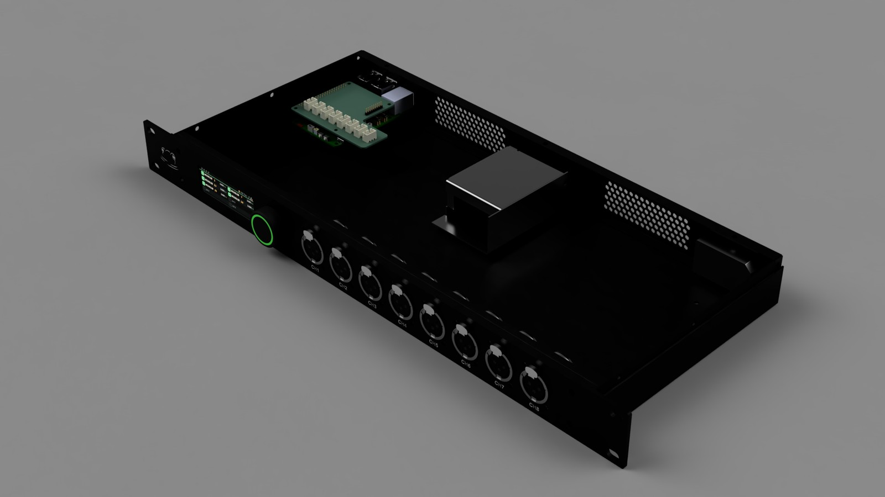

# pixfrog rack — 1U enclosure

Fusion 360 design for the 1U rack that houses the controller: the
ESP32-P4 Module DEV-KIT plus the [signal shield](../pixfrog_shield/README.md),
the front-panel UI, and the mains-to-5 V supply.



`pixfrog_rack.f3z` is a Fusion archive (`.f3z`) — the assembly and every linked
component in one file. Open it with **File → Open** in Fusion 360; it unpacks
into a project. Exported at design version 40.

## What's in the assembly

| Component | Role |
|---|---|
| `rack_1U_200_pixfrog` | The 1U chassis itself, 200 mm deep |
| `assembly` | Top-level assembly holding everything below |
| `ESP32-P4-Module-DEV-KIT_20250427` | Waveshare devkit, as the manufacturer's model |
| `shield_v1` | The LED bus shield that plugs onto the devkit's J1 |
| `UI_holder` | Front-panel bracket for the display and encoder |
| `écran_tft_2.79` | NV3007 2.79" bar panel (428×142) |
| `adafruit_seesaw` | Rotary encoder breakout |
| `knob` | Encoder knob |
| `XLR Connector PCB Mount 3 pole Female, NC3FD-V` | Neutrik XLR, DMX-style output |
| `powerplug` | Mains inlet |
| `S-15-5 power` | 5 V / 15 W enclosed PSU |
| `captive_CFBSOAM3-6`, `captive_CFBSOAM3-10` | Captive panel screws, M3 |

The pin assignments the UI and shield depend on are in
[`boards/esp32_p4_devkit.h`](../../boards/esp32_p4_devkit.h) — the single source
of truth. Panel geometry for the display is in
[`docs/HARDWARE.md`](../../docs/HARDWARE.md) §5.

## Note on the file

A `.f3z` is an opaque binary (~27 MB), and git would otherwise store a fresh
copy of it per revision — no delta applies to a compressed archive. `*.f3z` is
therefore tracked with **Git LFS** (see `.gitattributes` at the repo root): the
commit holds a ~130-byte pointer and the payload lives in LFS storage.

You need `git lfs` installed to get the real file. Without it a clone silently
yields the pointer text instead, and Fusion will simply report a corrupt
archive:

```bash
git lfs install     # once per machine
git lfs pull        # if you cloned before installing it
```
